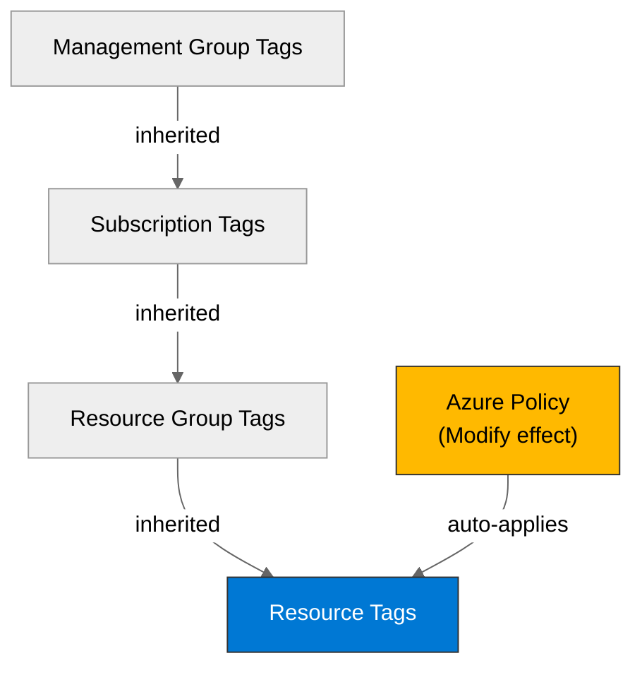

# 🛡️ Governance Constraints - {project-name}


<details open>
<summary><strong>📑 Governance Contents</strong></summary>

- [🔍 Discovery Source](#-discovery-source)
- [📋 Azure Policy Compliance](#-azure-policy-compliance)
- [🔄 Plan Adaptations Based on Policies](#-plan-adaptations-based-on-policies)
- [🚫 Deployment Blockers](#-deployment-blockers)
- [🏷️ Required Tags](#-required-tags)
- [🔐 Security Policies](#-security-policies)
- [💰 Cost Policies](#-cost-policies)
- [🌐 Network Policies](#-network-policies)
- [📜 Compliance Frameworks](#-compliance-frameworks)
- [References](#references)

</details>

> Generated by iac-planner agent | {date}

| ⬅️ Previous                                        | 📑 Index            | Next ➡️                                                |
| -------------------------------------------------- | ------------------- | ------------------------------------------------------ |
| [03-des-cost-estimate.md](03-des-cost-estimate.md) | [README](README.md) | [04-implementation-plan.md](04-implementation-plan.md) |

This document captures the governance constraints and Azure Policy requirements
that must be addressed in the Bicep implementation.

## 🔍 Discovery Source

> [!IMPORTANT]
> Governance constraints MUST be discovered from Azure Resource Graph, not assumed.

| Query              | Results                 | Timestamp  |
| ------------------ | ----------------------- | ---------- |
| Policy Assignments | {X} policies discovered | {ISO-8601} |
| Tag Policies       | {X} tags required       | {ISO-8601} |
| Security Policies  | {X} constraints         | {ISO-8601} |

**Discovery Method**: Azure Resource Graph via MCP
**Subscription**: {subscription-name}
**Scope**: {management-group / subscription / resource-group}

> [!WARNING]
> If this section shows "UNVERIFIED" or is empty, governance constraints were
> assumed rather than discovered. Deployment may fail due to undiscovered policies.

### L0 Discovery Envelope (MANDATORY)

The companion `04-governance-constraints.json` MUST include a
`discovery_metadata` envelope. This is the L0 attestation in the
four-layer governance stack — every downstream consumer (Planner,
CodeGen, Deploy) reads it first and STOPS on staleness or signature
drift. See
[governance-discovery.md](../../azure-defaults/references/governance-discovery.md#l0-discovery-envelope-mandatory)
for the full envelope shape and consumer protocol.

```jsonc
{
  "discovery_metadata": {
    "discovery_status": "COMPLETE",       // COMPLETE | PARTIAL | FAILED
    "discovered_at": "{ISO-8601}",
    "scope": {
      "subscription_id": "{subscription-id}",
      "management_groups": ["{mg-1}", "{mg-2}"]
    },
    "api_versions": {
      "policyAssignments": "2022-06-01",
      "policyDefinitions": "2021-06-01",
      "policyExemptions": "2022-07-01-preview"
    },
    "page_counts": {
      "policyAssignments": {X},
      "policyDefinitions": {X},
      "policyExemptions": {X}
    },
    "completeness_signature": "sha256:...",  // hash of stable-sorted policy tuples
    "ttl_days": 7                            // staleness threshold for consumers
  },
  "policies": [ ... ],
  "findings": [ ... ]
}
```

**Mandatory fields**: `discovery_status`, `discovered_at`, `scope`,
`api_versions`, `page_counts`, `completeness_signature`, `ttl_days`.
Schema enforced by
[`tools/schemas/governance-constraints.schema.json`](../../../../tools/schemas/governance-constraints.schema.json).

### Policy Definition Analysis

> [!IMPORTANT]
> **MANDATORY**: For all Deny and DeployIfNotExists policies, document analysis of policy definition JSON (policyRule).

**Purpose**: Prevent false positives from misleading policy display names.
Verify actual blocking behavior before documenting constraints.

**Required for each Deny/DeployIfNotExists policy**:

| Policy Display Name | Assignment Scope  | Effect | Actually Blocks         | Evidence from policyRule.if                 | Bicep Property Path                      | Required Value     |
| ------------------- | ----------------- | ------ | ----------------------- | ------------------------------------------- | ---------------------------------------- | ------------------ |
| {Policy Name}       | {Subscription/RG} | Deny   | {What it really blocks} | `field: "type", equals: "Microsoft.{Type}"` | {e.g., `properties.publicNetworkAccess`} | {e.g., `Disabled`} |

**Example**:

| Policy Display Name              | Assignment Scope | Effect            | Actually Blocks                                                         | Evidence from policyRule.if                                                      | Bicep Property Path   | Required Value |
| -------------------------------- | ---------------- | ----------------- | ----------------------------------------------------------------------- | -------------------------------------------------------------------------------- | --------------------- | -------------- |
| Block Azure RM Resource Creation | Management Group | Deny              | Classic resources only (ClassicCompute, ClassicStorage, ClassicNetwork) | `anyOf` with 7 conditions checking `field: "type"` for Microsoft.Classic\* types | N/A (Classic only)    | N/A            |
| Enforce storage encryption       | Subscription     | DeployIfNotExists | Nothing (auto-remediates)                                               | Adds encryption config automatically                                             | N/A (auto-remediated) | N/A            |

**Analysis Notes**:

- Document any policies initially flagged as blockers but cleared after JSON analysis
- List conditional logic (tag requirements, resource type filters, configuration checks)
- Note deployment modifications from Modify/DeployIfNotExists policies

## 📋 Azure Policy Compliance

| Category       | Constraint         | Implementation   | Status       |
| -------------- | ------------------ | ---------------- | ------------ |
| Naming         | {naming-standard}  | {implementation} | ✅ / ⚠️ / ❌ |
| Tagging        | {tagging-policy}   | {implementation} | ✅ / ⚠️ / ❌ |
| Security       | {security-policy}  | {implementation} | ✅ / ⚠️ / ❌ |
| Data Residency | {residency-policy} | {implementation} | ✅ / ⚠️ / ❌ |

> [!WARNING]
> Any ❌ items are deployment blockers — resolve before proceeding to code generation.

## 🔄 Plan Adaptations Based on Policies

> [!NOTE]
> This section documents how the implementation plan was adapted to comply with discovered Azure Policies.

### Architectural Changes

_Document any changes made to the original architecture to comply with Deny policies._

| Original Design         | Blocking Policy    | Effect | Adaptation Applied                              |
| ----------------------- | ------------------ | ------ | ----------------------------------------------- |
| Example: Public storage | Deny public access | Deny   | Changed to private endpoints + vNet integration |

_If no adaptations were needed, note: "✅ Original architecture complies with all discovered policies."_

### Auto-Applied Resources

_Document resources that will be auto-deployed by DeployIfNotExists policies._

| Policy                        | Effect            | Auto-Applied Resource             |
| ----------------------------- | ----------------- | --------------------------------- |
| Example: Deploy diag settings | DeployIfNotExists | Log Analytics diagnostic settings |

_If none, note: "✅ No additional resources will be auto-deployed."_

### Auto-Modified Configurations

_Document configuration changes that will be automatically applied by Modify policies._

| Policy                        | Effect | Auto-Applied Change                     |
| ----------------------------- | ------ | --------------------------------------- |
| Example: Inherit tags from RG | Modify | Tags auto-inherited from resource group |

_If none, note: "✅ No auto-modifications expected."_

## 🚫 Deployment Blockers

> [!CAUTION]
> **CRITICAL**: This section lists policies that BLOCK deployment. Resolution required before proceeding to code generation.

_If no blockers, show: "✅ No deployment blockers detected."_

_Otherwise, document each blocker:_

### {Policy Display Name}

- **Policy ID**: `{policy-id}`
- **Effect**: Deny
- **Scope**: {management-group / subscription / resource-group}
- **Enforcement Mode**: {Default / DoNotEnforce}
- **Impact**: {description of what is blocked}
- **Assessment Date**: {YYYY-MM-DD}

**Resolution Options**:

1. **Request Policy Exemption**:
   - **Justification**: {reason}
   - **Duration**: {temporary / permanent}
   - **Risk Level**: {low / medium / high}
   - **Approval Process**: {steps}

2. **Alternative Architecture**:
   - {Description of compliant alternative}
   - **Trade-offs**: {performance / cost / complexity impacts}

**Status**: ⚠️ **DEPLOYMENT CANNOT PROCEED WITHOUT RESOLUTION**

**Next Steps**:

- [ ] User confirms exemption approval
- [ ] OR User approves alternative architecture
- [ ] OR User provides timeline for exemption

## 🏷️ Required Tags

All resources must include the following tags:

```bicep
tags: {
  Environment: environment  // dev, staging, prod
  Project: projectName      // {project-name}
  ManagedBy: 'Bicep'
  Owner: owner
}
```



> Replace tag keys with actual discovered policy requirements.

## 🔐 Security Policies

| Policy           | Requirement   |
| ---------------- | ------------- |
| HTTPS Only       | {requirement} |
| TLS Version      | {requirement} |
| Public Access    | {requirement} |
| Managed Identity | {requirement} |
| Key Vault        | {requirement} |

## 💰 Cost Policies

| Policy            | Constraint   |
| ----------------- | ------------ |
| Budget            | {constraint} |
| SKU Restrictions  | {constraint} |
| Reserved Capacity | {constraint} |

## 🌐 Network Policies

| Policy            | Constraint   |
| ----------------- | ------------ |
| Private Endpoints | {constraint} |
| VNet Integration  | {constraint} |
| Public Endpoints  | {constraint} |

---

## 📜 Compliance Frameworks

> Audit/compliance assignments active at subscription or management-group scope.
> While they do not block deployments (audit effect), they may impose architecture constraints.

| Assignment        | Scope   | Type   |
| ----------------- | ------- | ------ |
| {assignment-name} | {scope} | {type} |

---

## References

| Topic                | Link                                                                                                                       |
| -------------------- | -------------------------------------------------------------------------------------------------------------------------- |
| Azure Policy         | [Overview](https://learn.microsoft.com/azure/governance/policy/overview)                                                   |
| Azure Resource Graph | [ARG Overview](https://learn.microsoft.com/azure/governance/resource-graph/overview)                                       |
| Tag Governance       | [Tagging Strategy](https://learn.microsoft.com/azure/cloud-adoption-framework/ready/azure-best-practices/resource-tagging) |

---

_Governance constraints discovered from Azure Resource Graph._
_See [governance-discovery.instructions.md](/.github/instructions/governance-discovery.instructions.md) for discovery methodology._

---

<div align="center">

| ⬅️ [03-des-cost-estimate.md](03-des-cost-estimate.md) | 🏠 [Project Index](README.md) | ➡️ [04-implementation-plan.md](04-implementation-plan.md) |
| ----------------------------------------------------- | ----------------------------- | --------------------------------------------------------- |

</div>
