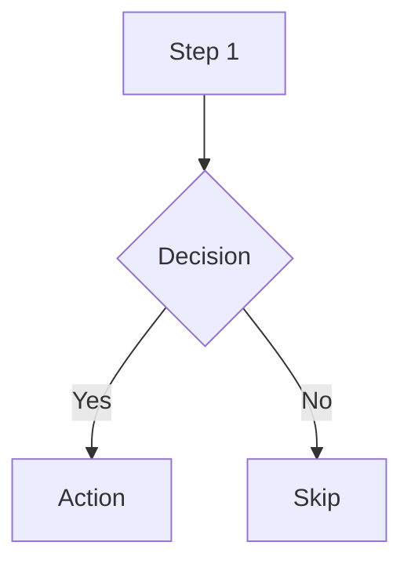
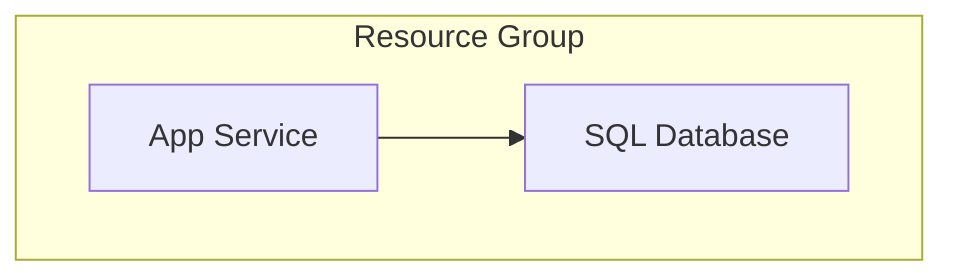
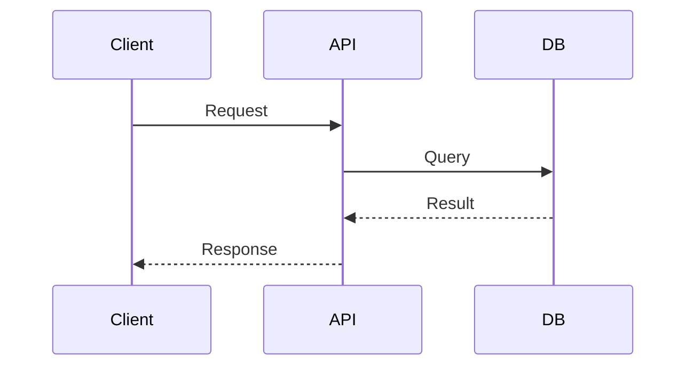
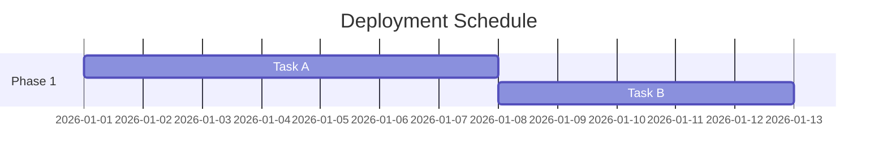
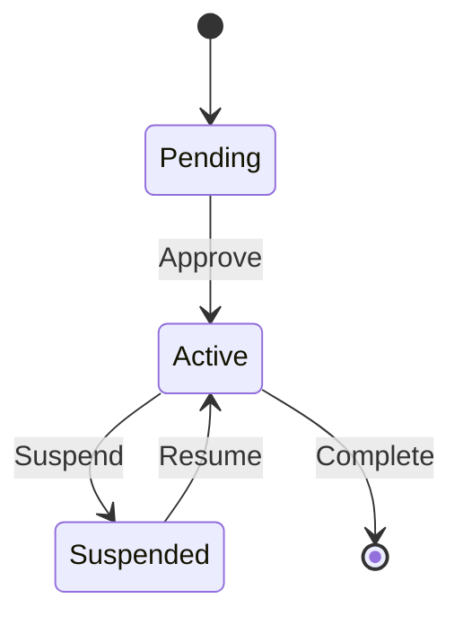
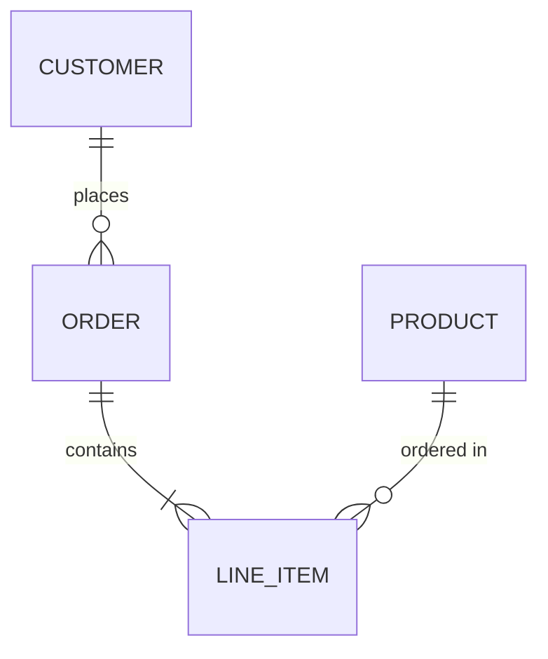

<!-- ref:mermaid-syntax-cheatsheet-v1 -->

# Mermaid Syntax Cheat Sheet

## Flowcharts

- `graph TB` for vertical layouts; `graph LR` for horizontal.
- Use subgraphs for logical grouping:

## Sequence Diagrams

## Gantt Charts

## State Diagrams

## ER Diagrams

## Azure Resource Visualization

For visualizing live Azure resource groups as Mermaid diagrams, use the
`azure-resources` skill (Mode B: Visualize). It runs Azure Resource Graph
queries and outputs Mermaid resource relationship diagrams.

### Resource Diagram Conventions

- Group by layer: Network, Compute, Data, Security, Monitoring
- Include resource details in node labels (use ` ` for line breaks)
- Label all connections descriptively
- Use subgraphs for logical grouping
- Connection types:
  - `-->` for data flow or dependencies
  - `-.->` for optional/conditional connections
  - `==>` for critical/primary paths
