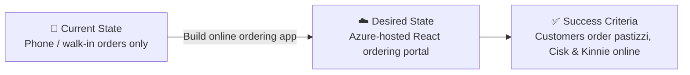

# 📋 Step 1: Requirements - Malta Catering

<strong>📑 Requirements Overview</strong>

- [🎯 Project Overview](#-project-overview)
- [🚀 Functional Requirements](#-functional-requirements)
- [⚡ Non-Functional Requirements (NFRs)](#-non-functional-requirements-nfrs)
- [🔒 Compliance & Security Requirements](#-compliance--security-requirements)
- [💰 Budget](#-budget)
- [🔧 Operational Requirements](#-operational-requirements)
- [🌍 Regional Preferences](#-regional-preferences)
- [📊 Complexity Classification](#-complexity-classification)
- [📋 Summary for Architecture Assessment](#-summary-for-architecture-assessment)
- [References](#references)

> Generated by @requirements agent | 2026-04-14

| ⬅️ Previous | 📑 Index            | Next ➡️                                                        |
| ----------- | ------------------- | -------------------------------------------------------------- |
| —           | [README](README.md) | [02-architecture-assessment.md](02-architecture-assessment.md) |

## 🎯 Project Overview

| Field                   | Value                                                                     |
| ----------------------- | ------------------------------------------------------------------------- |
| **Project Name**        | malta-catering                                                            |
| **Project Type**        | Full-Stack (SPA + API)                                                    |
| **Timeline**            | 2026-04-14 → Demo (30-min live session)                                   |
| **Primary Stakeholder** | Catering outlet owner (Malta)                                             |
| **Business Context**    | Online ordering app for a Malta catering outlet selling local specialties |

`iac_tool: Bicep`

### Business Context

| Field               | Value                                                                      |
| ------------------- | -------------------------------------------------------------------------- |
| Industry / Vertical | Food & Beverage / Hospitality                                              |
| Company Size        | Small (1-50 employees)                                                     |
| Current State       | Greenfield                                                                 |
| Migration Source    | N/A (greenfield)                                                           |
| Business Drivers    | Expand reach with online ordering; reduce phone-based order errors         |
| Success Criteria    | Customers can browse a menu, place orders, and receive delivery at address |

### State Transition

## 🚀 Functional Requirements

### Core Capabilities

| #   | Capability                     | Priority  | Acceptance Criteria                                      |
| --- | ------------------------------ | --------- | -------------------------------------------------------- |
| 1   | Browse menu (pastizzi, drinks) | 🔴 Must   | Customer sees current menu with prices                   |
| 2   | Place an order with delivery   | 🔴 Must   | Customer submits name, address, items; gets confirmation |
| 3   | View order status              | 🟡 Should | Customer can check if order is being prepared            |
| 4   | Social login (Google, etc.)    | 🟡 Should | Customer authenticates via social identity provider      |
| 5   | Admin: view incoming orders    | 🔴 Must   | Outlet staff see new orders in real time                 |

### User Types

| User Type    | Description                       | Est. Count | Access Level |
| ------------ | --------------------------------- | ---------- | ------------ |
| Customer     | Orders food/drinks online         | 100-1,000  | Reader       |
| Outlet Staff | Views and fulfils incoming orders | 1-5        | Contributor  |
| Outlet Owner | Manages menu, views sales         | 1          | Admin        |

### Integrations

| System                    | Direction | Protocol  | Auth Method  | SLA         |
| ------------------------- | --------- | --------- | ------------ | ----------- |
| Social Identity Providers | Inbound   | OAuth 2.0 | OAuth / OIDC | Best-effort |

### Data Types

| Category      | Sensitivity | Est. Volume   | Retention  | Residency |
| ------------- | ----------- | ------------- | ---------- | --------- |
| Customer PII  | 🟡 Medium   | < 10 KB/order | 90 days    | EU        |
| Order records | 🟢 Low      | ~86K rows/day | 1 year     | EU        |
| Menu items    | 🟢 Low      | < 1 KB        | Indefinite | EU        |

### Architecture Pattern

| Field              | Value                                                                                                                                        |
| ------------------ | -------------------------------------------------------------------------------------------------------------------------------------------- |
| Workload Pattern   | SPA + API (containerized React front-end with lightweight API)                                                                               |
| Recommended Option | App Service S1 (Linux containers) + ACR Premium + VNet + Table Storage + Key Vault                                                           |
| Tier               | Cost-Optimized                                                                                                                               |
| Justification      | Small outlet, low TPS (1/s), dev-only, always-on compute, VNet integration for private connectivity, staging slot for blue-green deployments |

## ⚡ Non-Functional Requirements (NFRs)

| WAF Pillar     | Metric             | Target                                       | Current | Gap |
| -------------- | ------------------ | -------------------------------------------- | ------- | --- |
| 🔄 Reliability | SLA                | 99.0%                                        | N/A     | —   |
| 🔄 Reliability | RTO                | 24 hours                                     | N/A     | —   |
| 🔄 Reliability | RPO                | 12 hours                                     | N/A     | —   |
| ⚡ Performance | Page Load          | < 3,000 ms                                   | N/A     | —   |
| ⚡ Performance | API Response (p95) | < 500 ms                                     | N/A     | —   |
| ⚡ Performance | Concurrent Users   | 100-1,000                                    | N/A     | —   |
| ⚡ Performance | Throughput         | 1 TPS                                        | N/A     | —   |
| 🔒 Security    | Auth Method        | Social IdP (OAuth 2.0)                       | —       | —   |
| 🔒 Security    | Encryption         | TLS 1.2 in-transit; platform-managed at-rest | —       | —   |
| 💰 Cost        | Monthly Budget     | EUR 100-500                                  | —       | —   |
| 🔧 Operations  | Uptime Monitoring  | Yes (basic)                                  | —       | —   |

### Scalability

| Dimension        | Current   | 6-Month Projection | 12-Month Projection |
| ---------------- | --------- | ------------------ | ------------------- |
| Users            | 100-1,000 | 1,000              | 2,000               |
| Data Volume      | < 100 MB  | 500 MB             | 1 GB                |
| Transactions/day | ~86,400   | ~100,000           | ~150,000            |

## 🔒 Compliance & Security Requirements

### Regulatory Frameworks

<strong>PCI-DSS</strong> — Not Applicable

| Requirement             | Applicability | Notes                                |
| ----------------------- | ------------- | ------------------------------------ |
| Cardholder data storage | No            | Payment is strictly cash on delivery |
| Network segmentation    | No            | No card data in scope                |
| Encryption requirements | No            | No payment card processing           |

<strong>SOC 2</strong> — Not Applicable

| Trust Principle | Applicability | Notes                       |
| --------------- | ------------- | --------------------------- |
| Security        | No            | Not required for this scope |
| Availability    | No            | Basic SLA sufficient        |
| Confidentiality | No            | No SOC 2 audit required     |

<strong>HIPAA</strong> — Not Applicable

| Requirement   | Applicability | Notes                  |
| ------------- | ------------- | ---------------------- |
| PHI handling  | No            | No health data         |
| BAA required  | No            | Not a healthcare app   |
| Audit logging | No            | Not required for HIPAA |

<strong>GDPR</strong> — Applicable

| Requirement      | Applicability | Notes                                            |
| ---------------- | ------------- | ------------------------------------------------ |
| EU data subjects | Yes           | Malta-based customers (EU citizens)              |
| Data residency   | Yes           | All data stored in swedencentral (EU)            |
| Right to erasure | Yes           | Must support deletion of customer PII on request |

<strong>ISO 27001</strong> — Not Applicable

| Control Area        | Applicability | Notes                       |
| ------------------- | ------------- | --------------------------- |
| Access control      | No            | Not required for this scope |
| Asset management    | No            | Simple environment          |
| Incident management | No            | Best-effort support model   |

### Data Residency

| Requirement              | Value         |
| ------------------------ | ------------- |
| Primary Region           | swedencentral |
| Data Sovereignty         | EU-only       |
| Cross-region Replication | Not required  |

### Authentication & Authorization

| Requirement       | Value                                                  |
| ----------------- | ------------------------------------------------------ |
| Identity Provider | Social IdPs via App Service Authentication (Easy Auth) |
| MFA Requirement   | Not required                                           |
| RBAC Model        | Application-level (staff vs customer)                  |

### Network Security

| Control                     | Required | Notes                                                     |
| --------------------------- | -------- | --------------------------------------------------------- |
| Private endpoints           | ✅       | Key Vault, Storage, ACR via VNet                          |
| VNet integration            | ✅       | App Service S1 with VNet integration                      |
| Public endpoints acceptable | ✅       | App Service public inbound only; backend services private |
| WAF required                | ❌       | Not justified for < 1K concurrent users                   |

### Recommended Security Controls

| Control               | Recommended | User Confirmed | Notes                                        |
| --------------------- | ----------- | -------------- | -------------------------------------------- |
| Managed Identity      | Yes         | Yes            | App Service to Key Vault, Storage, and ACR   |
| Private Endpoints     | Yes         | Yes            | Key Vault, Storage Account, ACR via VNet PE  |
| WAF                   | No          | No             | Low traffic; not cost-justified              |
| Key Vault for Secrets | Yes         | Yes            | Store storage connection strings securely    |
| Diagnostic Settings   | Yes         | —              | Basic logging to Log Analytics (recommended) |
| TLS 1.2 Minimum       | Yes         | Yes            | Enforced on all endpoints                    |
| Encryption at Rest    | Yes         | —              | Platform-managed (Azure default)             |
| Network Isolation     | Yes         | Yes            | VNet integration with private endpoints      |

## 💰 Budget

> [!NOTE]
> The Azure Pricing MCP server generates detailed cost estimates during
> architecture assessment (Step 2). Provide an approximate budget here.

| Field              | Value                                                      |
| ------------------ | ---------------------------------------------------------- |
| 💰 Monthly Budget  | EUR 100-500                                                |
| 📅 Annual Budget   | EUR 1,200-6,000                                            |
| 🚦 Limit Type      | 🟡 Soft (can negotiate within range)                       |
| 📊 Cost Model Pref | Fixed (App Service S1 always-on) + consumption for storage |

### Cost Optimization Priorities

| Priority                         | Selected | Impact |
| -------------------------------- | -------- | ------ |
| Minimize compute costs           | ☑        | High   |
| Prefer consumption-based pricing | ☑        | High   |
| Reserved instances acceptable    | ☐        | Low    |
| Spot instances for non-critical  | ☐        | Low    |

## 🔧 Operational Requirements

### Monitoring & Alerting

| Capability             | Required | Tool / Service       | Notes                   |
| ---------------------- | -------- | -------------------- | ----------------------- |
| Application monitoring | ✅       | Application Insights | Basic telemetry         |
| Log aggregation        | ✅       | Log Analytics        | App Service auto-config |
| Alert notifications    | ❌       | —                    | Not required for demo   |
| Custom dashboards      | ❌       | —                    | Not required for demo   |

### Support & Maintenance

| Requirement         | Value              |
| ------------------- | ------------------ |
| Support Hours       | Best-effort        |
| On-call Requirement | No                 |
| Maintenance Windows | Any time (dev env) |
| Change Management   | Self-service       |

### Backup & Disaster Recovery

| Component          | Backup Frequency | Retention | Recovery Method |
| ------------------ | ---------------- | --------- | --------------- |
| Table Storage data | Daily            | 30 days   | Manual restore  |
| Container images   | On push to ACR   | Latest 5  | Re-deploy       |

## 🌍 Regional Preferences

| Preference         | Value         | Justification                      |
| ------------------ | ------------- | ---------------------------------- |
| Primary Region     | swedencentral | EU GDPR-compliant, project default |
| Failover Region    | N/A           | Not required for dev/demo          |
| Availability Zones | Not needed    | 99.0% SLA target; single zone OK   |

---

## 📊 Complexity Classification

| Field      | Value                                                                                                                 |
| ---------- | --------------------------------------------------------------------------------------------------------------------- |
| Complexity | `simple`                                                                                                              |
| Criteria   | 7+ resource types (App Service, ACR, VNet, Private Endpoints, Storage, Key Vault, DNS Zones), single region, dev only |
| Rationale  | Small outlet, single environment, no custom policies, straightforward SPA + API                                       |

---

## 📋 Summary for Architecture Assessment

### Handoff Summary

| Aspect               | Key Points                                                                                            |
| -------------------- | ----------------------------------------------------------------------------------------------------- |
| Critical Constraints | GDPR data residency (EU-only); budget EUR 100-500/mo; payment on delivery                             |
| Key Decisions        | SPA + API on App Service S1 (containers); Table Storage for orders; Bicep IaC; VNet + PE; social auth |
| Open Risks           | Social IdP setup adds complexity; Table Storage query limitations for reporting                       |
| Recommended Pattern  | SPA + API (App Service S1 Linux Containers)                                                           |
| Budget Envelope      | EUR 100-500/month                                                                                     |

### Requirements Completeness

| Section                  | Status | Notes                                 |
| ------------------------ | ------ | ------------------------------------- |
| Project Overview         | ✅     | Complete                              |
| Functional Requirements  | ✅     | Core ordering flow defined            |
| NFRs                     | ✅     | 1 TPS, 99.0% SLA, relaxed recovery    |
| Compliance & Security    | ✅     | GDPR applicable; PCI/SOC/HIPAA not    |
| Budget                   | ✅     | EUR 100-500/month soft limit          |
| Operational Requirements | ✅     | Basic monitoring; best-effort support |

---

## References

> [!NOTE]
> 📚 The following Microsoft Learn resources provide additional guidance.

| Topic                      | Link                                                                                                |
| -------------------------- | --------------------------------------------------------------------------------------------------- |
| Well-Architected Framework | [Overview](https://learn.microsoft.com/azure/well-architected/)                                     |
| Azure App Service          | [Documentation](https://learn.microsoft.com/azure/app-service/)                                     |
| Azure Table Storage        | [Documentation](https://learn.microsoft.com/azure/storage/tables/)                                  |
| Azure Regions              | [Products by Region](https://azure.microsoft.com/explore/global-infrastructure/products-by-region/) |
| Compliance Offerings       | [Azure Compliance](https://learn.microsoft.com/azure/compliance/)                                   |

---

_Requirements captured using
[plan-requirements.prompt.md](../../.github/prompts/plan-requirements.prompt.md) template_

---

| ⬅️ — | 🏠 [Project Index](README.md) | ➡️ [02-architecture-assessment.md](02-architecture-assessment.md) |
| ---- | ----------------------------- | ----------------------------------------------------------------- |

