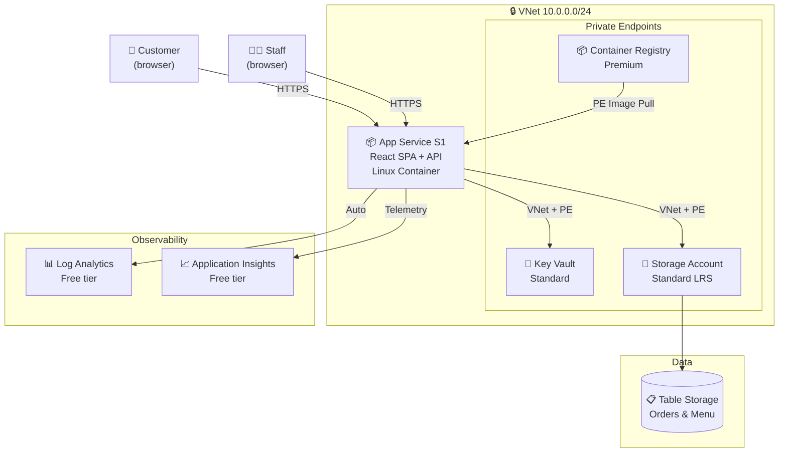
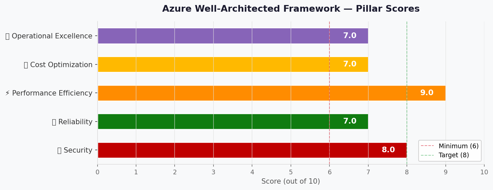

# 🏛️ Step 2: Architecture Assessment - Malta Catering

<strong>📑 Assessment Contents</strong>

- [✅ Requirements Validation](#-requirements-validation)
- [💎 Executive Summary](#-executive-summary)
- [🏛️ WAF Pillar Assessment](#-waf-pillar-assessment)
- [📦 Resource SKU Recommendations](#-resource-sku-recommendations)
- [🎯 Architecture Decision Summary](#-architecture-decision-summary)
- [🚀 Implementation Handoff](#-implementation-handoff)
- [🔒 Approval Gate](#-approval-gate)
- [References](#references)

> Generated by architect agent | 2026-04-14

| ⬅️ Previous                              | 📑 Index            | Next ➡️                                            |
| ---------------------------------------- | ------------------- | -------------------------------------------------- |
| [01-requirements.md](01-requirements.md) | [README](README.md) | [03-des-cost-estimate.md](03-des-cost-estimate.md) |

## ✅ Requirements Validation

| Requirement Area        | Status     | Validation Notes                                    |
| ----------------------- | ---------- | --------------------------------------------------- |
| NFRs (SLA, RTO, RPO)    | ✅ Defined | 99.0% SLA, 24h RTO, 12h RPO — relaxed for dev/demo  |
| Compliance requirements | ✅ Defined | GDPR applicable; PCI/SOC/HIPAA not in scope         |
| Budget (approximate)    | ✅ Defined | EUR 100-500/month soft limit, ~$155/mo estimated    |
| Scale requirements      | ✅ Defined | 1 TPS, 100-1K daily users, up to 1K concurrent      |
| Security controls       | ✅ Defined | Managed identity, Key Vault, TLS 1.2+, VNet + PE    |
| Data residency          | ✅ Defined | EU-only, swedencentral, no cross-region replication |

> [!NOTE]
> One open challenger finding from Step 1 (REQ-001: Table Storage lacks native
> backup) is addressed in the Reliability assessment below.

---

## 💎 Executive Summary

A lightweight ordering portal for a Malta catering outlet selling pastizzi,
Cisk, and Kinnie. The architecture uses **Azure App Service S1** (Linux
containers) with VNet integration to host a containerized React SPA with a
lightweight API, **Azure Table Storage** for order persistence, **Azure
Container Registry** (Premium) for image management, and **Azure Key Vault**
(Standard) for secrets. **Private endpoints** secure Key Vault, Storage, and
ACR traffic over a dedicated VNet. A **staging slot** enables blue-green
deployments. All resources deploy to **swedencentral** for GDPR compliance.

Estimated monthly cost: **~$155/month** (within EUR 100-500 budget).

### Recommended Architecture

---

## 🏛️ WAF Pillar Assessment

### Overall Scores

| Pillar                    | Score | Confidence | Summary                                           |
| ------------------------- | ----- | ---------- | ------------------------------------------------- |
| 🔒 Security               | 8/10  | High       | MI + KV + TLS 1.2; VNet + private endpoints       |
| 🔄 Reliability            | 7/10  | High       | 99.95% platform SLA; always-on, no cold start     |
| ⚡ Performance            | 9/10  | High       | 1 TPS is trivial; always-on eliminates cold start |
| 💰 Cost Optimization      | 7/10  | High       | ~$126/mo; within budget, higher than consumption  |
| 🔧 Operational Excellence | 7/10  | High       | Staging slot, built-in logging; no CI/CD yet      |

**Primary Pillar Optimized**: � Security
**Trade-offs Accepted**: Higher cost (~$126/mo vs ~$25/mo) for VNet + private
endpoints. No WAF, no multi-region. Data loss explicitly accepted for demo
(ARC-001). GDPR erasure pattern defined (ARC-003). Staff access via Entra ID
(ARC-005).

---

### 🔒 Security Assessment (8/10)

**Strengths:**

- Managed Identity for App Service → Key Vault and Storage (no keys in code)
- Key Vault Standard with RBAC authorization for secrets management
- TLS 1.2+ enforced on App Service (managed certificates)
- **VNet integration** with dedicated /24 address space (10.0.0.0/24)
- **Private endpoints** for Key Vault, Storage, and ACR — no public data plane exposure
- Platform-managed encryption at rest for Storage and Key Vault
- No PCI scope — payment is strictly cash on delivery
- App Service built-in auth supports social IdP (Google, Microsoft) via Easy Auth

**Gaps:**

- ⚠️ No WAF/DDoS protection — low traffic does not justify cost
- ⚠️ Social IdP data processing may cross EU boundaries (noted in REQ-002)
- ⚠️ Staff authentication requires a dedicated trust boundary (ARC-005 — see below)

**GDPR Data Erasure Pattern (ARC-003):**

Table Storage entities must separate PII from order facts to support right-to-erasure:

| Partition       | Row Key     | Contains PII    | Erasure Action              |
| --------------- | ----------- | --------------- | --------------------------- |
| `customer_{id}` | `profile`   | Yes             | Delete entire entity        |
| `order_{date}`  | `{orderId}` | No (anonymized) | Retain (customer_id → hash) |

On erasure request: delete `customer_*` entities, replace `customer_id` with
a one-way hash in order entities. Orders are retained for business records
with no reversible PII.

**Staff Access Trust Boundary (ARC-005):**

Staff operations (view orders, update status) must use a separate
authentication path with verified role claims:

1. Staff authenticate via Microsoft Entra ID (work accounts) —
   separate from customer social login
2. App Service built-in auth validates `roles` claim in the JWT
3. API enforces role-based access at the route level (`/api/staff/*`
   requires `Staff` role)
4. Customer routes (`/api/orders`) require only a valid social IdP token

This creates two trust boundaries: customers (social IdP, low privilege)
and staff (Entra ID, elevated privilege).

**Recommendations:**

1. Use App Service built-in authentication for social login (zero-cost)
2. ✅ Private endpoints implemented for Key Vault, Storage, and ACR
3. Document that social IdP identity tokens are processed by the IdP outside EU;
   only application data stays in swedencentral
4. ARC-004 resolved: VNet + private endpoints replace public endpoints

### 🔄 Reliability Assessment (7/10)

**Strengths:**

- App Service S1 SLA: 99.95% (exceeds 99.0% target)
- Always-on eliminates cold start — consistent response times
- Staging slot enables blue-green deployments with zero-downtime swaps
- Storage Account LRS: 11 nines durability within swedencentral
- ACR Premium stores images durably with geo-redundant metadata
- Built-in health probes and auto-restart on App Service
- Single region is acceptable for dev/demo with relaxed RTO (24h)

**Gaps:**

- ❌ No automated backup for Table Storage (REQ-001/ARC-001) — **explicitly accepted for demo** (see below)
- ⚠️ No failover region configured

**ARC-001 Resolution — Table Storage Backup:**

> **Decision**: For this dev/demo environment, data loss is **explicitly accepted**.
> The 12h RPO requirement from Step 1 is **relaxed to best-effort** for the demo.
> Table Storage LRS provides 11 nines durability against hardware failure but
> does **not** protect against accidental deletion or application-level corruption.
>
> **Production path**: Before promoting to production, add a scheduled Azure
> Function (timer trigger, daily) that exports all Table Storage entities to
> Blob Storage as JSON. Estimated additional cost: ~$1-2/month.

**Recommendations:**

1. ✅ Demo: accept data loss risk (RPO relaxed to best-effort)
2. ⚠️ Production: implement daily export job before go-live
3. ✅ Always-on enabled — no cold start concerns
4. For production: consider GRS storage or Cosmos DB for geo-redundancy

### ⚡ Performance Assessment (9/10)

**Strengths:**

- 1 TPS is negligible for App Service S1 (handles thousands of TPS)
- Always-on eliminates cold start — consistent sub-second response times
- Table Storage supports 20,000 entities/second per account — 1 TPS is trivial
- React SPA delivers fast client-side rendering after initial load

**Gaps:**

- ⚠️ No CDN for static assets (acceptable for demo with < 1K users)

**Recommendations:**

1. 30-second polling interval for order status is acceptable for demo
2. For production: add Azure CDN or Front Door for static asset caching
3. ✅ Always-on eliminates cold start — no min-replicas tuning needed

### 💰 Cost Assessment (7/10)

| Metric           | Value                                     |
| ---------------- | ----------------------------------------- |
| Monthly Estimate | ~$155/month                               |
| Annual Estimate  | ~$1,858/year                              |
| Budget Status    | ✅ Within budget (25-126% of EUR 100-500) |
| Confidence       | High (App Service S1 pricing confirmed)   |

> 📎 Full cost breakdown: [03-des-cost-estimate.md](03-des-cost-estimate.md)

**Cost Optimization Applied:**

- App Service S1 with always-on (~$73/mo — eliminates cold starts)
- ACR Premium (~$50/mo — supports private endpoints, 500 GiB storage)
- VNet + private endpoints (~$23/mo — secures data plane traffic)
- Standard LRS storage (cheapest durable option)
- Log Analytics free tier (< 5 GiB/month ingestion)
- Key Vault per-operation pricing (negligible at low TPS)
- Staging slot included in S1 tier (zero additional cost)

### 🔧 Operational Excellence Assessment (7/10)

**Strengths:**

- App Service auto-configures Log Analytics integration
- Staging slot enables blue-green deployments with zero-downtime swaps
- Managed TLS certificates eliminate renewal burden
- Familiar App Service platform with extensive tooling support
- Bicep IaC ensures repeatable infrastructure

**Gaps:**

- ⚠️ No CI/CD pipeline defined (manual container pushes)
- ⚠️ No custom alerts or dashboards
- ⚠️ No runbook automation for incident response
- ⚠️ Best-effort support model (no SLA for operational response)

**ARC-002 Resolution — Application Monitoring:**

Application Insights is added to the architecture (free tier, 5 GiB/month).
This addresses the monitoring gap identified in the requirements:

- Application Insights provides request timing, dependency tracing, and
  application-level failure diagnostics (beyond platform logs)
- Auto-instrumentation via App Service
- Free tier (5 GiB/month) is sufficient for demo traffic
- Shares the same Log Analytics workspace as the backend

**Recommendations:**

1. Define a GitHub Actions workflow for CI/CD in a later phase
2. Add basic Azure Monitor alerts for 5xx errors and high latency
3. Document a simple operational runbook for container restart procedures
4. Configure Application Insights connection string via Key Vault

---

## 📦 Resource SKU Recommendations

| Service            | Recommended SKU    | Configuration                  | Monthly Est. | Justification                                |
| ------------------ | ------------------ | ------------------------------ | ------------ | -------------------------------------------- |
| Virtual Network    | Standard           | 10.0.0.0/24, 2 subnets         | $0.00        | Included (no per-VNet charge)                |
| App Service Plan   | S1                 | Linux, always-on               | $73.00       | Always-on, staging slot, VNet integration    |
| Web App            | S1 Linux container | Managed identity, staging slot | Included     | Included in App Service Plan                 |
| Container Registry | Premium            | 500 GiB storage, PE            | $50.00       | Private endpoint support, sufficient storage |
| Storage Account    | Standard LRS GPv2  | Table + Blob, PE               | $8.47        | Cheapest durable option                      |
| Key Vault          | Standard           | RBAC auth, PE                  | $0.30        | Per-operation, negligible cost               |
| Private DNS Zones  | Standard           | 3 zones (KV, Storage, ACR)     | $1.50        | Required for PE name resolution              |
| Private Endpoints  | Standard           | 3 endpoints                    | $21.60       | Secures KV, Storage, ACR traffic             |
| Log Analytics      | Per-GB (free tier) | < 5 GiB/month                  | $0.00        | Free tier covers demo volume                 |

<strong>App Service Plan</strong> — Pricing Tier Comparison

| Tier | vCPU | RAM      | Price/mo | VNet | Staging Slot | Fits? |
| ---- | ---- | -------- | -------- | ---- | ------------ | ----- |
| B1   | 1    | 1.75 GiB | ~$13     | ❌   | ❌           | ❌    |
| S1   | 1    | 1.75 GiB | ~$73     | ✅   | ✅           | ✅    |
| P1v3 | 2    | 8 GiB    | ~$138    | ✅   | ✅           | ⚠️    |

**Selected**: S1 — VNet integration + staging slot at lowest cost. Resolves
ACA capacity blocker in swedencentral.

<strong>Container Registry</strong> — Pricing Tier Comparison

| Tier     | Storage | Throughput  | Price/mo | PE Support | Fits? |
| -------- | ------- | ----------- | -------- | ---------- | ----- |
| Basic    | 10 GiB  | 2 webhooks  | $5.00    | ❌         | ❌    |
| Standard | 100 GiB | 10 webhooks | $21.00   | ❌         | ❌    |
| Premium  | 500 GiB | Geo-rep     | $50.00   | ✅         | ✅    |

**Selected**: Premium — required for private endpoint support.

<strong>Storage Account</strong> — Redundancy Comparison

| Redundancy | Durability     | Price/GB/mo | Fits? |
| ---------- | -------------- | ----------- | ----- |
| LRS        | 11 nines local | $0.0184     | ✅    |
| ZRS        | 12 nines zonal | $0.023      | ⚠️    |
| GRS        | 16 nines geo   | $0.034      | ❌    |

**Selected**: LRS — cheapest; single region is acceptable for dev/demo.
EU-only requirement satisfied (no cross-region replication).

---

## 🎯 Architecture Decision Summary

| Decision           | Choice                                           | Rationale                                                                |
| ------------------ | ------------------------------------------------ | ------------------------------------------------------------------------ |
| Compute platform   | App Service S1 (Linux containers)                | Always-on, VNet integration, staging slot, resolves ACA capacity blocker |
| Persistence        | Azure Table Storage (LRS)                        | Simple key-value, < $10/mo, 20K TPS capacity                             |
| Image registry     | ACR Premium                                      | 500 GiB, ~$50/mo, private endpoint support                               |
| Secrets management | Key Vault Standard                               | Managed Identity integration, per-op pricing                             |
| Authentication     | App Service Built-in Auth                        | Zero-cost social IdP integration (Google, MS)                            |
| Monitoring         | Log Analytics + Application Insights (free tier) | Auto-configured with App Service; App Insights for app telemetry         |
| Backup strategy    | Explicitly accept data loss for demo (ARC-001)   | RPO relaxed to best-effort; prod: add daily export job                   |
| GDPR erasure       | PII/order separation in Table Storage (ARC-003)  | customer\_\* entities deletable; orders anonymized                       |
| Staff access       | Entra ID with role claims (ARC-005)              | Separate trust boundary from customer social auth                        |
| Network posture    | VNet + private endpoints (ARC-004 resolved)      | PE for Key Vault, Storage, ACR; public ingress only                      |
| Region             | swedencentral                                    | EU GDPR-compliant, project default                                       |
| IaC tool           | Bicep                                            | Azure-native, AVM modules available for all services                     |

### Top Architecture Risks

| Risk                               | WAF Pillar     | Likelihood | Impact    | Mitigation                                          |
| ---------------------------------- | -------------- | ---------- | --------- | --------------------------------------------------- |
| Table Storage data loss            | 🔄 Reliability | 🟢 Low     | 🟡 Medium | LRS durability; prod: add export job                |
| Higher cost (~$155/mo vs ~$25/mo)  | 💰 Cost        | 🟢 Low     | 🟢 Low    | Within budget; trade-off for security + reliability |
| Social IdP token processing in US  | 🔒 Security    | 🟡 Medium  | 🟢 Low    | App data stays in EU; document assumption           |
| No CI/CD increases deployment risk | 🔧 Operations  | 🟡 Medium  | 🟢 Low    | Staging slot reduces risk; add GitHub Actions later |

---

## 🚀 Implementation Handoff

### Ready for iac-planner

The architecture is approved for implementation with the following key parameters:

| Parameter      | Value                          |
| -------------- | ------------------------------ |
| Region         | swedencentral                  |
| Environment    | dev                            |
| Budget         | EUR 100-500/month (est: ~$155) |
| Resource Count | 10                             |

### Resources to Provision

| #   | Resource                | SKU                | Key Config                                     |
| --- | ----------------------- | ------------------ | ---------------------------------------------- |
| 1   | Virtual Network         | Standard           | 10.0.0.0/24, 2 subnets (ASP delegation + PE)   |
| 2   | App Service Plan        | S1                 | Linux, always-on                               |
| 3   | Web App                 | S1 Linux container | HTTP ingress, managed identity, staging slot   |
| 4   | Container Registry      | Premium            | Admin disabled, managed identity pull, PE      |
| 5   | Storage Account         | Standard LRS GPv2  | Table service enabled, HTTPS-only, TLS 1.2, PE |
| 6   | Key Vault               | Standard           | RBAC auth, purge protection enabled, PE        |
| 7   | Private DNS Zones (×3)  | Standard           | privatelink.vaultcore, blob, azurecr           |
| 8   | Private Endpoints (×3)  | Standard           | KV, Storage, ACR                               |
| 9   | Log Analytics Workspace | Per-GB             | 30-day retention (free tier)                   |
| 10  | Application Insights    | Free tier          | Connected to Log Analytics workspace           |

### Security Requirements for Implementation

| Requirement           | Implementation                                     |
| --------------------- | -------------------------------------------------- |
| VNet Integration      | App Service delegated subnet in 10.0.0.0/24        |
| Private Endpoints     | PE for Key Vault, Storage, ACR on dedicated subnet |
| Private DNS Zones     | 3 zones for privatelink name resolution            |
| Managed Identity      | System-assigned MI on Web App → KV + Storage + ACR |
| Key Vault RBAC        | Key Vault Secrets User role for Web App MI         |
| Storage RBAC          | Storage Table Data Contributor role for Web App MI |
| ACR Pull              | AcrPull role for Web App MI                        |
| TLS 1.2 minimum       | `minTlsVersion: 'TLS1_2'` on Storage Account       |
| HTTPS only            | `supportsHttpsTrafficOnly: true` on Storage        |
| No public blob access | `allowBlobPublicAccess: false` on Storage          |
| App Service auth      | Built-in auth with social IdP (Google)             |

### Monitoring Requirements for Implementation

| Requirement             | Implementation                                                            |
| ----------------------- | ------------------------------------------------------------------------- |
| Log aggregation         | Log Analytics Workspace linked to App Service                             |
| Web App logs            | System and app logs to Log Analytics                                      |
| Application telemetry   | Application Insights for request tracing, dependency monitoring (ARC-002) |
| Basic health monitoring | App Service built-in health probes                                        |

---

## 🔒 Approval Gate

> [!IMPORTANT]
> **🏗️ Architecture Assessment Complete**
>
> | Pillar      | Score |
> | ----------- | ----- |
> | Security    | 8/10  |
> | Reliability | 7/10  |
> | Performance | 9/10  |
> | Cost        | 7/10  |
> | Operations  | 7/10  |
>
> **Estimated Monthly Cost**: ~$155 (within EUR 100-500 budget)
>
> **Confidence Level**: High (App Service S1 pricing confirmed)
>
> - [ ] **Approved** — proceed to iac-planner
> - Approver: \_\_\_
> - Date: \_\_\_
>
> Reply **"approve"** to proceed to iac-planner, or provide feedback for revisions.

---

## References

> [!NOTE]
> 📚 The following Microsoft Learn resources informed this assessment.

| Topic                      | Link                                                                                                 |
| -------------------------- | ---------------------------------------------------------------------------------------------------- |
| Well-Architected Framework | [Overview](https://learn.microsoft.com/azure/well-architected/)                                      |
| App Service Overview       | [Documentation](https://learn.microsoft.com/azure/app-service/)                                      |
| App Service Auth           | [Built-in Auth](https://learn.microsoft.com/azure/app-service/overview-authentication-authorization) |
| VNet Integration           | [Documentation](https://learn.microsoft.com/azure/app-service/overview-vnet-integration)             |
| Private Endpoints          | [Documentation](https://learn.microsoft.com/azure/private-link/private-endpoint-overview)            |
| Table Storage              | [Documentation](https://learn.microsoft.com/azure/storage/tables/)                                   |
| Key Vault                  | [Overview](https://learn.microsoft.com/azure/key-vault/general/overview)                             |
| ACR Tiers                  | [Service Tiers](https://learn.microsoft.com/azure/container-registry/container-registry-skus)        |
| Security Checklist         | [WAF Security](https://learn.microsoft.com/azure/well-architected/security/checklist)                |
| Reliability Checklist      | [WAF Reliability](https://learn.microsoft.com/azure/well-architected/reliability/checklist)          |
| Cost Optimization          | [WAF Cost](https://learn.microsoft.com/azure/well-architected/cost-optimization/checklist)           |

---

_Assessment performed using Azure Well-Architected Framework.
Pricing data from Azure Pricing MCP (2026-04-14)._

---

| ⬅️ [01-requirements.md](01-requirements.md) | 🏠 [Project Index](README.md) | ➡️ [03-des-cost-estimate.md](03-des-cost-estimate.md) |
| ------------------------------------------- | ----------------------------- | ----------------------------------------------------- |

