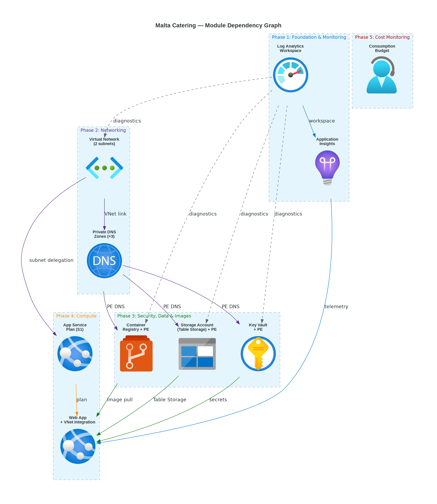
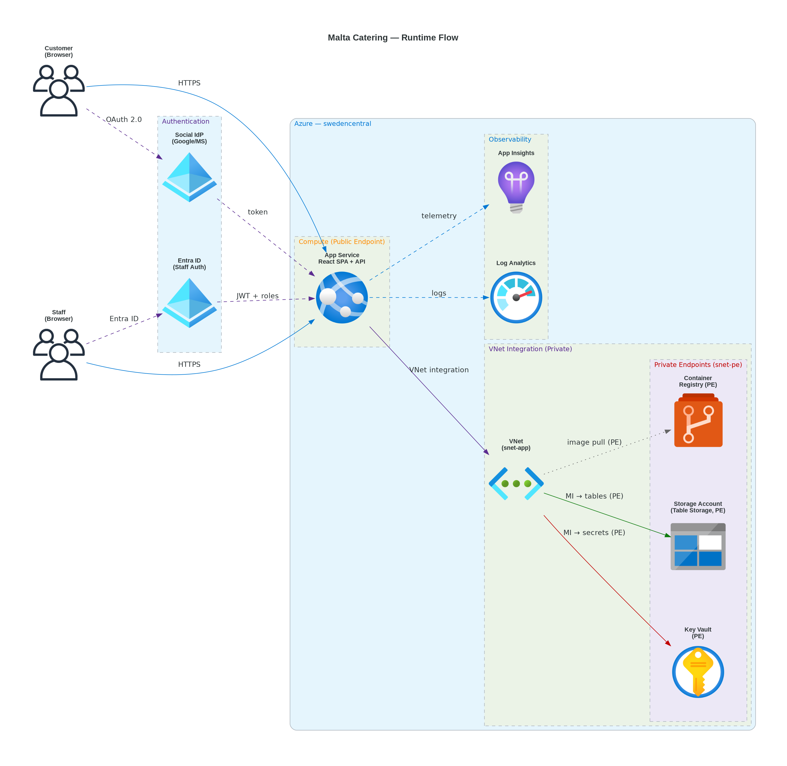

# 📀 Step 4: Implementation Plan - Malta Catering


<details open>
<summary><strong>📑 Implementation Contents</strong></summary>

- [📋 Overview](#-overview)
- [📦 Resource Inventory](#-resource-inventory)
- [🗂️ Module Structure](#-module-structure)
- [🔨 Implementation Tasks](#-implementation-tasks)
- [🚀 Deployment Phases](#-deployment-phases)
- [🔗 Dependency Graph](#-dependency-graph)
- [🔄 Runtime Flow Diagram](#-runtime-flow-diagram)
- [🏷️ Naming Conventions](#-naming-conventions)
- [🔐 Security Configuration](#-security-configuration)
- [⏱️ Estimated Implementation Time](#-estimated-implementation-time)
- [🔒 Approval Gate](#-approval-gate)
- [References](#references)

</details>

> Generated by IaC Planner agent | 2026-04-14

| ⬅️ Previous                                                  | 📑 Index            | Next ➡️                                        |
| ------------------------------------------------------------ | ------------------- | ---------------------------------------------- |
| [04-governance-constraints.md](04-governance-constraints.md) | [README](README.md) | [04-preflight-check.md](04-preflight-check.md) |

## 📋 Overview

Bicep implementation plan for the Malta Catering ordering portal — a lightweight SPA + API
on Azure App Service (S1) with VNet integration and private endpoints, backed by Table
Storage, Key Vault, and a full observability stack. All architecture resources plus a
cost-monitoring budget are covered by AVM modules or native Bicep resources. Deployment
uses a **5-phase** strategy with dependency-ordered sequencing and validation gates
between phases.

**Governance adaptation**: The resource group must carry 9 tags enforced by a
management-group-level Deny policy (`JV-Enforce Resource Group Tags v3`). The
deployment contract expands beyond the default 4-tag model accordingly. Storage
and Key Vault network hardening are audit-only warnings in the current scope
and are set explicitly in IaC for visibility.

---

## 📦 Resource Inventory

| Resource                   | Type                                       | SKU               | AVM Module                                            | Version      | Dependencies                              | Status  |
| -------------------------- | ------------------------------------------ | ----------------- | ----------------------------------------------------- | ------------ | ----------------------------------------- | ------- |
| Log Analytics Workspace    | `Microsoft.OperationalInsights/workspaces` | Per-GB (free)     | ✅ `br/public:avm/res/operational-insights/workspace` | `0.15.0`     | —                                         | ⬜ Todo |
| Application Insights       | `Microsoft.Insights/components`            | Free tier         | ✅ `br/public:avm/res/insights/component`             | `0.7.1`      | Log Analytics                             | ⬜ Todo |
| Virtual Network            | `Microsoft.Network/virtualNetworks`        | —                 | ✅ `br/public:avm/res/network/virtual-network`        | `0.7.0`      | —                                         | ⬜ Todo |
| Private DNS Zone (KV)      | `Microsoft.Network/privateDnsZones`        | —                 | ✅ `br/public:avm/res/network/private-dns-zone`       | `0.7.0`      | VNet                                      | ⬜ Todo |
| Private DNS Zone (Storage) | `Microsoft.Network/privateDnsZones`        | —                 | ✅ `br/public:avm/res/network/private-dns-zone`       | `0.7.0`      | VNet                                      | ⬜ Todo |
| Private DNS Zone (ACR)     | `Microsoft.Network/privateDnsZones`        | —                 | ✅ `br/public:avm/res/network/private-dns-zone`       | `0.7.0`      | VNet                                      | ⬜ Todo |
| Key Vault                  | `Microsoft.KeyVault/vaults`                | Standard          | ✅ `br/public:avm/res/key-vault/vault`                | `0.13.3`     | Log Analytics, VNet, DNS Zone             | ⬜ Todo |
| Storage Account            | `Microsoft.Storage/storageAccounts`        | Standard LRS GPv2 | ✅ `br/public:avm/res/storage/storage-account`        | `0.32.0`     | Log Analytics, VNet, DNS Zone             | ⬜ Todo |
| Container Registry         | `Microsoft.ContainerRegistry/registries`   | Premium           | ✅ `br/public:avm/res/container-registry/registry`    | `0.12.1`     | Log Analytics, VNet, DNS Zone             | ⬜ Todo |
| App Service Plan           | `Microsoft.Web/serverfarms`                | S1                | ✅ `br/public:avm/res/web/serverfarm`                 | `0.4.0`      | —                                         | ⬜ Todo |
| Web App                    | `Microsoft.Web/sites`                      | —                 | ✅ `br/public:avm/res/web/site`                       | `0.15.0`     | ASP, VNet, ACR, KV, Storage, App Insights | ⬜ Todo |
| Consumption Budget         | `Microsoft.Consumption/budgets`            | —                 | ❌ Native (AVM is MG-scoped only)                     | `2023-11-01` | —                                         | ⬜ Todo |

> **AVM coverage**: 11/12 resources use AVM modules. Budget uses a native Bicep resource because
> the AVM budget module (`avm/res/consumption/budget/mg-scope`) targets management-group scope,
> not resource-group scope. Container Registry is upgraded to Premium SKU to support private endpoints.

---

## 🛡️ Governance Compliance Matrix

> [!IMPORTANT]
> L1 attestation in the four-layer governance stack. Every Deny policy
> from `04-governance-constraints.json` MUST appear as at least one row
> here, bound to a specific resource and property. Generated from the
> constraints JSON; do not hand-author.

| Resource ID             | Policy ID                              | Effect | Satisfied By Property                        | Required Value | Status       |
| ----------------------- | -------------------------------------- | ------ | -------------------------------------------- | -------------- | ------------ |
| `storageAccount`        | `require-https-storage`                | Deny   | `properties.supportsHttpsTrafficOnly`        | `true`         | ✅ satisfied |
| `storageAccount`        | `restrict-public-blob-access`          | Deny   | `properties.allowBlobPublicAccess`           | `false`        | ✅ satisfied |
| `keyVault`              | `require-soft-delete-keyvault`         | Deny   | `properties.enableSoftDelete`                | `true`         | ✅ satisfied |
| `keyVault`              | `require-purge-protection-keyvault`    | Deny   | `properties.enablePurgeProtection`           | `true`         | ✅ satisfied |
| `appServicePlan/webApp` | `require-managed-identity-app-service` | Deny   | `identity.type`                              | `SystemAssigned` | ✅ satisfied |
| `resourceGroup`         | `require-tags-rg`                      | Deny   | `tags[Environment,Project,Owner,CostCenter]` | non-empty      | ✅ satisfied |

**Status legend**:

- ✅ `satisfied` — property is wired in the plan with the required value
- ⚠️ `pending` — property declared but value not yet finalised
- ❌ `unsatisfiable` — no plan shape satisfies this Deny; **return to 04g-Governance**

---

## 🗂️ Module Structure

```text
infra/bicep/malta-catering/
├── main.bicep                          # Orchestration — phased module calls
├── main.bicepparam                     # Parameter file (.bicepparam format)
├── modules/
│   ├── log-analytics.bicep             # AVM: operational-insights/workspace
│   ├── app-insights.bicep              # AVM: insights/component
│   ├── virtual-network.bicep           # AVM: network/virtual-network
│   ├── private-dns-zones.bicep         # AVM: network/private-dns-zone (×3)
│   ├── key-vault.bicep                 # AVM: key-vault/vault + PE
│   ├── storage.bicep                   # AVM: storage/storage-account + PE
│   ├── container-registry.bicep        # AVM: container-registry/registry + PE
│   ├── app-service-plan.bicep          # AVM: web/serverfarm
│   ├── web-app.bicep                   # AVM: web/site + VNet integration
│   └── budget.bicep                    # Native: Microsoft.Consumption/budgets
└── deploy.ps1                          # Deployment script with what-if
```

| Module                   | AVM Source                                         | Version  | Purpose                                     |
| ------------------------ | -------------------------------------------------- | -------- | ------------------------------------------- |
| log-analytics.bicep      | `br/public:avm/res/operational-insights/workspace` | `0.15.0` | Shared log sink for all resources           |
| app-insights.bicep       | `br/public:avm/res/insights/component`             | `0.7.1`  | Application-level telemetry                 |
| virtual-network.bicep    | `br/public:avm/res/network/virtual-network`        | `0.7.0`  | VNet with subnets for ASP + PE              |
| private-dns-zones.bicep  | `br/public:avm/res/network/private-dns-zone`       | `0.7.0`  | DNS zones for KV, Storage, ACR PEs          |
| key-vault.bicep          | `br/public:avm/res/key-vault/vault`                | `0.13.3` | Secrets management with RBAC auth + PE      |
| storage.bicep            | `br/public:avm/res/storage/storage-account`        | `0.32.0` | Table Storage for orders and menu data + PE |
| container-registry.bicep | `br/public:avm/res/container-registry/registry`    | `0.12.1` | Premium-tier image registry + PE            |
| app-service-plan.bicep   | `br/public:avm/res/web/serverfarm`                 | `0.4.0`  | S1 App Service Plan (Linux)                 |
| web-app.bicep            | `br/public:avm/res/web/site`                       | `0.15.0` | React SPA + API with MI + VNet integration  |
| budget.bicep             | Native `Microsoft.Consumption/budgets@2023-11-01`  | —        | Cost monitoring with forecast alerts        |

---

## 🔨 Implementation Tasks

### Task 1: main.bicep (Orchestration)

**Purpose**: Top-level entry point. Generates the unique suffix, defines shared parameters, and calls all modules in dependency order.

**Parameters**:

- `location` (string, default: `'swedencentral'`)
- `environment` (string, default: `'dev'`)
- `project` (string, default: `'malta-catering'`)
- `owner` (string) — tag value for governance
- `costcenter` (string) — tag value for governance
- `application` (string, default: `'malta-catering'`)
- `workload` (string, default: `'ordering-portal'`)
- `sla` (string, default: `'99.0'`)
- `backupPolicy` (string, default: `'none-demo'`)
- `maintWindow` (string, default: `'sun-02-06'`)
- `technicalContact` (string) — email for governance tag
- `budgetAmount` (int, default: `500`) — monthly EUR
- `budgetContactEmails` (array) — cost alert recipients
- `budgetStartDate` (string) — `YYYY-MM-01` format
- `containerImageName` (string, default: `'malta-catering-app'`)
- `containerImageTag` (string, default: `'latest'`)
- `vnetAddressPrefix` (string, default: `'10.0.0.0/16'`)
- `appServiceSubnetPrefix` (string, default: `'10.0.1.0/24'`)
- `privateEndpointSubnetPrefix` (string, default: `'10.0.2.0/24'`)

**Variables**:

- `uniqueSuffix = uniqueString(resourceGroup().id)` — generated once, passed to all modules
- `tags` — object with all 9 governance-required tags plus `ManagedBy: 'Bicep'`

**Modules Called** (in order):

1. `log-analytics.bicep`
2. `app-insights.bicep` ← depends on Log Analytics output
3. `virtual-network.bicep` ← standalone
4. `private-dns-zones.bicep` ← depends on VNet output
5. `key-vault.bicep` ← depends on Log Analytics, VNet, DNS Zone outputs
6. `storage.bicep` ← depends on Log Analytics, VNet, DNS Zone outputs
7. `container-registry.bicep` ← depends on Log Analytics, VNet, DNS Zone outputs
8. `app-service-plan.bicep` ← standalone
9. `web-app.bicep` ← depends on ASP, VNet, ACR, KV, Storage, App Insights outputs
10. `budget.bicep` ← standalone

### Task 2: modules/log-analytics.bicep

**Resources** (via AVM):

- Log Analytics Workspace: `log-malta-catering-dev`, Per-GB tier, 30-day retention

**Key Configuration**:

```yaml
sku: PerGB2018
retentionInDays: 30
dailyQuotaGb: 5 # free-tier cap
```

**Outputs**: `resourceId`, `resourceName`

### Task 3: modules/app-insights.bicep

**Resources** (via AVM):

- Application Insights: `appi-malta-catering-dev`, linked to Log Analytics workspace

**Key Configuration**:

```yaml
kind: web
applicationType: web
workspaceResourceId: <logAnalytics.outputs.resourceId>
```

**Outputs**: `resourceId`, `connectionString`, `instrumentationKey`

### Task 4: modules/key-vault.bicep

**Resources** (via AVM):

- Key Vault: `kv-malta-dev-{suffix}` (24-char limit)
- RBAC authorization enabled, purge protection on
- Diagnostic settings to Log Analytics

**Key Configuration**:

```yaml
enableRbacAuthorization: true
enablePurgeProtection: true
enableSoftDelete: true
softDeleteRetentionInDays: 7
diagnosticSettings:
  - workspaceResourceId: <logAnalytics.outputs.resourceId>
    categoryGroup: allLogs
    metrics: AllMetrics
```

**Outputs**: `resourceId`, `resourceName`, `uri`

### Task 5: modules/storage.bicep

**Resources** (via AVM):

- Storage Account: `stmaltadev{suffix}` (24-char limit, no hyphens)
- Table service enabled for orders and menu entities
- Governance hardening applied explicitly

**Key Configuration**:

```yaml
kind: StorageV2
sku: Standard_LRS
minimumTlsVersion: TLS1_2
supportsHttpsTrafficOnly: true
allowBlobPublicAccess: false
allowSharedKeyAccess: false # Entra ID auth only (governance Modify policy)
tableServices:
  tables:
    - name: orders
    - name: menu
    - name: customers
diagnosticSettings:
  - workspaceResourceId: <logAnalytics.outputs.resourceId>
```

**Outputs**: `resourceId`, `resourceName`, `primaryEndpoints`

### Task 6: modules/container-registry.bicep

**Resources** (via AVM):

- Container Registry: `acrmaltadev{suffix}` (no hyphens)
- Premium SKU (required for private endpoints), admin user disabled
- Private endpoint in PE subnet, linked to private DNS zone

**Key Configuration**:

```yaml
sku: Premium
adminUserEnabled: false
publicNetworkAccess: Disabled
privateEndpoints:
  - subnetResourceId: <vnet.outputs.peSubnetId>
    privateDnsZoneGroup:
      privateDnsZoneGroupConfigs:
        - privateDnsZoneResourceId: <dnsZones.outputs.acrZoneId>
diagnosticSettings:
  - workspaceResourceId: <logAnalytics.outputs.resourceId>
```

**Outputs**: `resourceId`, `resourceName`, `loginServer`

### Task 7: modules/virtual-network.bicep

**Resources** (via AVM):

- Virtual Network: `vnet-malta-catering-dev`, address space `10.0.0.0/16`
- Subnet `snet-app`: `10.0.1.0/24` — delegated to `Microsoft.Web/serverFarms` for App Service VNet integration
- Subnet `snet-pe`: `10.0.2.0/24` — for private endpoints (KV, Storage, ACR)

**Key Configuration**:

```yaml
addressSpace: ["10.0.0.0/16"]
subnets:
  - name: snet-app
    addressPrefix: 10.0.1.0/24
    delegation:
      name: Microsoft.Web/serverFarms
  - name: snet-pe
    addressPrefix: 10.0.2.0/24
```

**Outputs**: `resourceId`, `resourceName`, `appSubnetId`, `peSubnetId`

### Task 8: modules/private-dns-zones.bicep

**Resources** (via AVM, ×3 zones):

- `privatelink.vaultcore.azure.net` — Key Vault PE DNS
- `privatelink.table.core.windows.net` — Storage Table PE DNS
- `privatelink.azurecr.io` — Container Registry PE DNS
- Each zone linked to the VNet

**Key Configuration**:

```yaml
zones:
  - name: privatelink.vaultcore.azure.net
    virtualNetworkLinks:
      - virtualNetworkResourceId: <vnet.outputs.resourceId>
  - name: privatelink.table.core.windows.net
    virtualNetworkLinks:
      - virtualNetworkResourceId: <vnet.outputs.resourceId>
  - name: privatelink.azurecr.io
    virtualNetworkLinks:
      - virtualNetworkResourceId: <vnet.outputs.resourceId>
```

**Outputs**: `kvZoneId`, `storageZoneId`, `acrZoneId`

### Task 9: modules/app-service-plan.bicep

**Resources** (via AVM):

- App Service Plan: `asp-malta-catering-dev`
- S1 tier (Linux), single instance

**Key Configuration**:

```yaml
kind: linux
reserved: true
skuName: S1
skuCapacity: 1
```

**Outputs**: `resourceId`, `resourceName`

### Task 10: modules/web-app.bicep

**Resources** (via AVM):

- Web App: `app-malta-catering-dev`
- System-assigned managed identity
- VNet integration via `snet-app` subnet
- Linux container deployment from ACR
- Staging slot for blue-green deployments
- Role assignments: KV Secrets User, Storage Table Data Contributor, ACR Pull

**Key Configuration**:

```yaml
kind: app,linux,container
serverFarmResourceId: <asp.outputs.resourceId>
managedIdentities:
  systemAssigned: true
siteConfig:
  http20Enabled: true
  linuxFxVersion: "DOCKER|<acr.loginServer>/<imageName>:<imageTag>"
  appSettings:
    - name: APPLICATIONINSIGHTS_CONNECTION_STRING
      value: <appInsights.outputs.connectionString>
    - name: AZURE_STORAGE_ACCOUNT_NAME
      value: <storage.resourceName>
    - name: AZURE_KEYVAULT_URI
      value: <keyVault.uri>
    - name: DOCKER_REGISTRY_SERVER_URL
      value: "https://<acr.loginServer>"
virtualNetworkSubnetId: <vnet.outputs.appSubnetId>
slots:
  - name: staging
roleAssignments:
  - roleDefinitionId: Key Vault Secrets User (4633458b-17de-408a-b874-0445c86b69e6)
    principalType: ServicePrincipal
    scope: keyVault
  - roleDefinitionId: Storage Table Data Contributor (0a9a7e1f-b9d0-4cc4-a60d-0319b160aaa3)
    principalType: ServicePrincipal
    scope: storageAccount
  - roleDefinitionId: AcrPull (7f951dda-4ed3-4680-a7ca-43fe172d538d)
    principalType: ServicePrincipal
    scope: containerRegistry
```

**Outputs**: `resourceId`, `resourceName`, `defaultHostName`, `principalId`

### Task 11: modules/budget.bicep

**Resources** (native Bicep):

- Consumption Budget: `budget-malta-catering-dev`
- Monthly time grain, 3 forecast alert thresholds

**Key Configuration**:

```yaml
category: Cost
amount: <budgetAmount> # parameterized, default 500
timeGrain: Monthly
notifications:
  forecast80:
    threshold: 80
    thresholdType: Forecasted
    contactEmails: <budgetContactEmails>
  actual100:
    threshold: 100
    thresholdType: Actual
    contactEmails: <budgetContactEmails>
  forecast120:
    threshold: 120
    thresholdType: Forecasted
    contactEmails: <budgetContactEmails>
```

**Outputs**: `budgetId`, `budgetName`

### Task 12: deploy.ps1 (Deployment Script)

**Features**:

- Parameter validation (required: `owner`, `costcenter`, `technicalContact`, `budgetContactEmails`)
- Bicep lint and build pre-check
- `az deployment group what-if` preview before execution
- Interactive approval gate before actual deployment
- Post-deployment output display (FQDN, resource IDs)

---

## 📤 Code-Generation Contract

> [!IMPORTANT]
> Per-resource enumeration of inputs CodeGen (Step 5) MUST wire. This
> contract is frozen with the plan at gate-3; CodeGen refuses to invent
> parameters not listed here and returns to Planner if a needed param is
> missing.

### storageAccount

- **Required parameters**:
  - `storageAccountName` — `string` — CAF-named storage account
  - `location` — `string` — Resource location
  - `tags` — `object` — Required tags per governance contract
- **Secrets** (Key Vault references only — never inline): _None._
- **Managed identity bindings**: _None (accessed via private endpoint)._
- **External dependencies**:
  - `privateEndpointSubnetId` — subnet resource ID for PE placement
  - `privateDnsZoneId` — private DNS zone for `privatelink.table.core.windows.net`

### keyVault

- **Required parameters**:
  - `keyVaultName` — `string` — CAF-named Key Vault
  - `location` — `string` — Resource location
  - `tags` — `object` — Required tags
  - `tenantId` — `string` — Entra tenant ID
- **Secrets** (Key Vault references only — never inline): _None._
- **Managed identity bindings**:
  - Type: `system-assigned` (web app identity granted Key Vault Secrets User)
- **External dependencies**:
  - `privateEndpointSubnetId` — subnet resource ID for PE placement
  - `privateDnsZoneId` — private DNS zone for `privatelink.vaultcore.azure.net`

### containerRegistry

- **Required parameters**:
  - `acrName` — `string` — CAF-named container registry
  - `location` — `string` — Resource location
  - `tags` — `object` — Required tags
- **Secrets** (Key Vault references only — never inline): _None._
- **Managed identity bindings**:
  - Type: `system-assigned` (web app identity granted AcrPull)
- **External dependencies**:
  - `privateEndpointSubnetId` — subnet resource ID for PE placement
  - `privateDnsZoneId` — private DNS zone for `privatelink.azurecr.io`

### appServicePlan

- **Required parameters**:
  - `appServicePlanName` — `string` — CAF-named App Service Plan
  - `location` — `string` — Resource location
  - `tags` — `object` — Required tags
  - `skuName` — `string` — `S1`
- **Secrets** (Key Vault references only — never inline): _None._
- **External dependencies**: _None._

### webApp

- **Required parameters**:
  - `webAppName` — `string` — CAF-named Web App
  - `location` — `string` — Resource location
  - `tags` — `object` — Required tags
  - `appServicePlanId` — `string` — Resource ID of App Service Plan
- **Secrets** (Key Vault references only — never inline):
  - `storageConnectionString` — `@Microsoft.KeyVault(SecretUri=...)` pattern
- **Environment variables**:
  - `AZURE_STORAGE_ACCOUNT_NAME` — storage account name output
  - `AZURE_KEYVAULT_URI` — Key Vault URI output
- **Managed identity bindings**:
  - Type: `system-assigned`
  - Grants: Key Vault Secrets User, Storage Table Data Contributor, AcrPull
- **External dependencies**:
  - `virtualNetworkSubnetId` — App Service VNet integration subnet
  - `keyVaultId` — Key Vault resource ID
  - `storageAccountId` — Storage Account resource ID
  - `containerRegistryId` — ACR resource ID

**Contract enforcement**:

- CodeGen Phase 2 reads this section ONCE; agents do not invent parameters absent from this list.
- If a needed input is missing, CodeGen returns to Planner via `↩ Return to Step 4`.


---

## 🚀 Deployment Phases

> Deployment strategy: **Phased** (chosen during planning) — 5 phases with validation gates

### Phase 1: Foundation & Monitoring

| Order | Module              | Resources               | Validation                           |
| ----- | ------------------- | ----------------------- | ------------------------------------ |
| 1     | log-analytics.bicep | Log Analytics Workspace | Workspace accessible, data ingesting |
| 2     | app-insights.bicep  | Application Insights    | Connected to Log Analytics workspace |

**Approval Gate**: Verify Log Analytics workspace is provisioned and App Insights is linked.

### Phase 2: Networking

| Order | Module                  | Resources                        | Validation                                         |
| ----- | ----------------------- | -------------------------------- | -------------------------------------------------- |
| 3     | virtual-network.bicep   | VNet + 2 subnets (app, PE)       | VNet provisioned, subnets have correct delegations |
| 4     | private-dns-zones.bicep | 3 Private DNS Zones + VNet links | DNS zones linked to VNet, resolving correctly      |

**Approval Gate**: Verify VNet and subnets are provisioned. Confirm DNS zones are linked.

### Phase 3: Security, Data & Images

| Order | Module                   | Resources                                  | Validation                                               |
| ----- | ------------------------ | ------------------------------------------ | -------------------------------------------------------- |
| 5     | key-vault.bicep          | Key Vault (Standard, RBAC auth) + PE       | RBAC enabled, PE active, diagnostic settings on          |
| 6     | storage.bicep            | Storage Account (LRS GPv2) + 3 tables + PE | HTTPS-only, no public blob, no shared key, PE active     |
| 7     | container-registry.bicep | Container Registry (Premium) + PE          | Admin disabled, PE active, login server reachable via PE |

**Approval Gate**: Verify security hardening on KV and Storage. Confirm PEs resolve via private DNS. Confirm ACR accepts image push.

### Phase 4: Compute

| Order | Module                 | Resources                                      | Validation                                                                            |
| ----- | ---------------------- | ---------------------------------------------- | ------------------------------------------------------------------------------------- |
| 8     | app-service-plan.bicep | App Service Plan (S1 Linux)                    | Plan provisioned, S1 SKU confirmed                                                    |
| 9     | web-app.bicep          | Web App + MI + VNet integration + staging slot | App deployed, MI has KV/Storage/ACR roles, VNet integrated, default hostname responds |

**Approval Gate**: Verify Web App is running, managed identity roles are assigned, VNet integration is active, default hostname returns HTTP 200.

### Phase 5: Cost Monitoring

| Order | Module       | Resources                               | Validation                              |
| ----- | ------------ | --------------------------------------- | --------------------------------------- |
| 10    | budget.bicep | Consumption Budget + 3 alert thresholds | Budget visible in Azure Cost Management |

**Approval Gate**: Verify budget appears in Azure Cost Management with correct thresholds.

### Phase Summary

| Phase     | Name                    | Resources  | Est. Deploy Time | Approval Gate |
| --------- | ----------------------- | ---------- | ---------------- | ------------- |
| 1         | Foundation & Monitoring | 2          | ~3 min           | ✅            |
| 2         | Networking              | 4          | ~3 min           | ✅            |
| 3         | Security, Data & Images | 3 (+3 PEs) | ~5 min           | ✅            |
| 4         | Compute                 | 2          | ~6 min           | ✅            |
| 5         | Cost Monitoring         | 1          | ~1 min           | ✅            |
| **Total** |                         | **~12**    | **~18 min**      |               |

---

## 🔗 Dependency Graph



Source: [04-dependency-diagram.py](./04-dependency-diagram.py) (Python `diagrams` library)

> Map each node label to an Implementation Task heading in the task table above.

---

## 🔄 Runtime Flow Diagram



Source: [04-runtime-diagram.py](./04-runtime-diagram.py) (Python `diagrams` library)

> Runtime view focused on request, auth, secret, data, and telemetry paths.

---

## 🏷️ Naming Conventions

| Resource                | Pattern                     | Example (dev)               | Generated Name                |
| ----------------------- | --------------------------- | --------------------------- | ----------------------------- |
| Resource Group          | `rg-{project}-{env}`        | `rg-malta-catering-dev`     | `rg-malta-catering-dev`       |
| Log Analytics Workspace | `log-{project}-{env}`       | `log-malta-catering-dev`    | `log-malta-catering-dev`      |
| Application Insights    | `appi-{project}-{env}`      | `appi-malta-catering-dev`   | `appi-malta-catering-dev`     |
| Virtual Network         | `vnet-{project}-{env}`      | `vnet-malta-catering-dev`   | `vnet-malta-catering-dev`     |
| App Service Plan        | `asp-{project}-{env}`       | `asp-malta-catering-dev`    | `asp-malta-catering-dev`      |
| Web App                 | `app-{project}-{env}`       | `app-malta-catering-dev`    | `app-malta-catering-dev`      |
| Key Vault               | `kv-{short}-{env}-{suffix}` | `kv-malta-dev-a1b2`         | `kv-malta-dev-{uniqueSuffix}` |
| Storage Account         | `st{short}{env}{suffix}`    | `stmaltadeva1b2`            | `stmaltadev{uniqueSuffix}`    |
| Container Registry      | `acr{short}{env}{suffix}`   | `acrmaltadeva1b2`           | `acrmaltadev{uniqueSuffix}`   |
| Consumption Budget      | `budget-{project}-{env}`    | `budget-malta-catering-dev` | `budget-malta-catering-dev`   |

> `{suffix}` = first 4-6 characters of `uniqueString(resourceGroup().id)`, applied only to
> globally-unique names (Storage Account, Key Vault, Container Registry).

### Governance Tag Contract (9 Required Tags on Resource Group)

| Tag                 | Source    | Value (dev)             |
| ------------------- | --------- | ----------------------- |
| `environment`       | Parameter | `dev`                   |
| `owner`             | Parameter | _(user-supplied)_       |
| `costcenter`        | Parameter | _(user-supplied)_       |
| `application`       | Parameter | `malta-catering`        |
| `workload`          | Parameter | `ordering-portal`       |
| `sla`               | Parameter | `99.0`                  |
| `backup-policy`     | Parameter | `none-demo`             |
| `maint-window`      | Parameter | `sun-02-06`             |
| `technical-contact` | Parameter | _(user-supplied email)_ |

> An additional `tech-contact` tag (same value as `technical-contact`) is included on the
> resource group to bridge the governance mismatch between the Deny policy and the tag
> inheritance Modify policy.

---

## 🔐 Security Configuration

| Resource            | Security Setting                     | Value                                                  |
| ------------------- | ------------------------------------ | ------------------------------------------------------ |
| Storage Account     | `minimumTlsVersion`                  | `TLS1_2`                                               |
| Storage Account     | `supportsHttpsTrafficOnly`           | `true`                                                 |
| Storage Account     | `allowBlobPublicAccess`              | `false`                                                |
| Storage Account     | `allowSharedKeyAccess`               | `false` (Entra ID only)                                |
| Storage Account     | Private Endpoint                     | `snet-pe` subnet, `privatelink.table.core.windows.net` |
| Key Vault           | `enableRbacAuthorization`            | `true`                                                 |
| Key Vault           | `enablePurgeProtection`              | `true`                                                 |
| Key Vault           | `enableSoftDelete`                   | `true` (7-day retention)                               |
| Key Vault           | Private Endpoint                     | `snet-pe` subnet, `privatelink.vaultcore.azure.net`    |
| Container Registry  | `adminUserEnabled`                   | `false`                                                |
| Container Registry  | SKU                                  | `Premium` (required for PE)                            |
| Container Registry  | Private Endpoint                     | `snet-pe` subnet, `privatelink.azurecr.io`             |
| Web App             | `managedIdentities.systemAssigned`   | `true`                                                 |
| Web App             | `http20Enabled`                      | `true`                                                 |
| Web App             | VNet Integration                     | `snet-app` subnet delegation                           |
| Web App → Key Vault | Role: Key Vault Secrets User         | System-assigned MI                                     |
| Web App → Storage   | Role: Storage Table Data Contributor | System-assigned MI                                     |
| Web App → ACR       | Role: AcrPull                        | System-assigned MI                                     |
| All resources       | Diagnostic settings                  | All logs + metrics → Log Analytics                     |

---

## ⏱️ Estimated Implementation Time

| Task                             | Estimated Duration |
| -------------------------------- | ------------------ |
| Bicep modules (10 modules)       | 60 minutes         |
| Parameter file + deploy script   | 15 minutes         |
| Testing (lint + build + what-if) | 15 minutes         |
| Deployment (5 phases)            | 20 minutes         |
| **Total**                        | **~110 minutes**   |

---

## 🔒 Approval Gate

> [!IMPORTANT]
> **📋 Implementation Plan Ready**
>
> | Metric                           | Value                                                          |
> | -------------------------------- | -------------------------------------------------------------- |
> | Azure resources planned          | ~12                                                            |
> | Bicep modules to create          | 10 (9 AVM + 1 native)                                          |
> | Deployment phases                | 5 (Foundation → Networking → Security/Data → Compute → Budget) |
> | Governance constraints addressed | ✅ 9-tag RG policy + Storage/KV hardening + VNet/PE            |
> | CAF naming conventions applied   | ✅                                                             |
> | Cost monitoring included         | ✅ Budget with 3 forecast alerts                               |
>
> - [ ] **Approved** — proceed to Bicep CodeGen (Step 5)
> - **Approver**: ******\_\_\_\_******
> - **Date**: ******\_\_\_\_******
>
> Reply **"approve"** to proceed to Bicep CodeGen, or provide feedback.

---

## References

> [!NOTE]
> 📚 The following Microsoft Learn resources inform this implementation.

| Topic                  | Link                                                                                                                          |
| ---------------------- | ----------------------------------------------------------------------------------------------------------------------------- |
| Azure Verified Modules | [AVM Index](https://aka.ms/avm/index)                                                                                         |
| Bicep Best Practices   | [Documentation](https://learn.microsoft.com/azure/azure-resource-manager/bicep/best-practices)                                |
| CAF Naming Conventions | [Naming Rules](https://learn.microsoft.com/azure/cloud-adoption-framework/ready/azure-best-practices/resource-naming)         |
| Resource Abbreviations | [Abbreviations](https://learn.microsoft.com/azure/cloud-adoption-framework/ready/azure-best-practices/resource-abbreviations) |
| Web App AVM            | [Module Docs](https://github.com/Azure/bicep-registry-modules/tree/main/avm/res/web/site)                                     |
| App Service Plan AVM   | [Module Docs](https://github.com/Azure/bicep-registry-modules/tree/main/avm/res/web/serverfarm)                               |
| Virtual Network AVM    | [Module Docs](https://github.com/Azure/bicep-registry-modules/tree/main/avm/res/network/virtual-network)                      |
| Private DNS Zone AVM   | [Module Docs](https://github.com/Azure/bicep-registry-modules/tree/main/avm/res/network/private-dns-zone)                     |
| Consumption Budgets    | [Template Reference](https://learn.microsoft.com/azure/templates/microsoft.consumption/budgets)                               |

---

_Plan generated by IaC Planner agent following Azure Well-Architected Framework guidelines._

---

<div align="center">

| ⬅️ [04-governance-constraints.md](04-governance-constraints.md) | 🏠 [Project Index](README.md) | ➡️ [04-preflight-check.md](04-preflight-check.md) |
| --------------------------------------------------------------- | ----------------------------- | ------------------------------------------------- |

</div>
