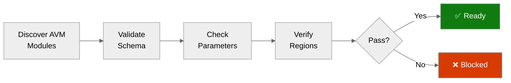

# ✅ Step 4b: Pre-Flight AVM Check - Malta Catering

<strong>📑 Pre-Flight Contents</strong>

- [🎯 Purpose](#-purpose)
- [✅ AVM Schema Validation Results](#-avm-schema-validation-results)
- [🔎 Parameter Type Analysis](#-parameter-type-analysis)
- [🌍 Region Limitations Identified](#-region-limitations-identified)
- [⚠️ Pitfalls Checklist](#-pitfalls-checklist)
- [🚀 Ready for Implementation](#-ready-for-implementation)

> Generated by bicep-code agent | 2026-04-14
> Status: **PASS**

| ⬅️ Previous                                            | 📑 Index            | Next ➡️                                                          |
| ------------------------------------------------------ | ------------------- | ---------------------------------------------------------------- |
| [04-implementation-plan.md](04-implementation-plan.md) | [README](README.md) | [05-implementation-reference.md](05-implementation-reference.md) |

## 🎯 Purpose

> [!IMPORTANT]
> This checkpoint validates AVM module schemas BEFORE Bicep code generation.

Prevents:

- Parameter type mismatches between planner assumptions and AVM module contracts.
- Unsupported defaults that would silently force extra networking prerequisites.
- Governance drift between resource-group deny tags and child-resource modify tags.
- Security baseline regressions in storage, registry, Key Vault, and App Service.

## ✅ AVM Schema Validation Results

| Resource                | AVM Module Path                                    | Version      | Status |
| ----------------------- | -------------------------------------------------- | ------------ | ------ |
| Log Analytics Workspace | `br/public:avm/res/operational-insights/workspace` | `0.15.0`     | ✅     |
| Application Insights    | `br/public:avm/res/insights/component`             | `0.7.1`      | ✅     |
| Virtual Network         | `br/public:avm/res/network/virtual-network`        | `0.7.0`      | ✅     |
| Private DNS Zone (×3)   | `br/public:avm/res/network/private-dns-zone`       | `0.7.0`      | ✅     |
| Key Vault               | `br/public:avm/res/key-vault/vault`                | `0.13.3`     | ✅     |
| Storage Account         | `br/public:avm/res/storage/storage-account`        | `0.32.0`     | ✅     |
| Container Registry      | `br/public:avm/res/container-registry/registry`    | `0.12.1`     | ✅     |
| App Service Plan        | `br/public:avm/res/web/serverfarm`                 | `0.4.0`      | ✅     |
| Web App                 | `br/public:avm/res/web/site`                       | `0.15.0`     | ✅     |
| Consumption Budget      | Native `Microsoft.Consumption/budgets@2024-08-01`  | `2024-08-01` | ✅     |

## 🔎 Parameter Type Analysis

<strong>Log Analytics Parameters</strong>

| Parameter                             | Expected Type | Notes                                              |
| ------------------------------------- | ------------- | -------------------------------------------------- |
| `dailyQuotaGb`                        | `string`      | Fractional or whole GB values are strings.         |
| `dataRetention`                       | `int`         | 30 days is valid for this demo deployment.         |
| `diagnosticSettings.useThisWorkspace` | `bool`        | Lets the workspace self-target diagnostics safely. |

<strong>Managed Environment Parameters</strong>

| Parameter     | Expected Type | Notes                                     |
| ------------- | ------------- | ----------------------------------------- |
| `kind`        | `string`      | Use `'linux'` for Linux App Service Plan. |
| `reserved`    | `bool`        | Must be `true` for Linux plans.           |
| `skuName`     | `string`      | Use `'S1'` for Standard tier.             |
| `skuCapacity` | `int`         | Default `1` for single instance in dev.   |

<strong>Web App Parameters</strong>

| Parameter                   | Expected Type | Notes                                                    |
| --------------------------- | ------------- | -------------------------------------------------------- | ---------------------------------- |
| `kind`                      | `string`      | Use `'app,linux,container'` for Linux container Web App. |
| `serverFarmResourceId`      | `string`      | Resource ID of the App Service Plan.                     |
| `managedIdentities`         | `object`      | System-assigned identity is enabled here.                |
| `siteConfig.linuxFxVersion` | `string`      | Use `'DOCKER                                             | <registry>/<image>:<tag>'` format. |
| `siteConfig.http20Enabled`  | `bool`        | Must be `true` per security baseline.                    |
| `virtualNetworkSubnetId`    | `string`      | Resource ID of the VNet integration subnet (`snet-app`). |
| `slots`                     | `array`       | Include `staging` slot for blue-green deployments.       |

<strong>Virtual Network Parameters</strong>

| Parameter                  | Expected Type | Notes                                                          |
| -------------------------- | ------------- | -------------------------------------------------------------- |
| `addressPrefixes`          | `array`       | Use `['10.0.0.0/16']` for the VNet address space.              |
| `subnets[0].name`          | `string`      | `'snet-app'` with delegation to `Microsoft.Web/serverFarms`.   |
| `subnets[0].addressPrefix` | `string`      | `'10.0.1.0/24'` — sufficient for App Service VNet integration. |
| `subnets[1].name`          | `string`      | `'snet-pe'` for private endpoints (no delegation).             |
| `subnets[1].addressPrefix` | `string`      | `'10.0.2.0/24'` — accommodates KV, Storage, and ACR PEs.       |

<strong>Private DNS Zone + PE Parameters</strong>

| Parameter                                        | Expected Type | Notes                                           |
| ------------------------------------------------ | ------------- | ----------------------------------------------- |
| `name` (KV zone)                                 | `string`      | `'privatelink.vaultcore.azure.net'`             |
| `name` (Storage zone)                            | `string`      | `'privatelink.table.core.windows.net'`          |
| `name` (ACR zone)                                | `string`      | `'privatelink.azurecr.io'`                      |
| `virtualNetworkLinks[].virtualNetworkResourceId` | `string`      | Resource ID of the VNet for DNS resolution.     |
| PE `subnetResourceId`                            | `string`      | Resource ID of `snet-pe` subnet.                |
| PE `privateDnsZoneGroup`                         | `object`      | Links PE to the corresponding private DNS zone. |

<strong>Security Baseline Parameters</strong>

| Resource             | Parameter                  | Required Value              |
| -------------------- | -------------------------- | --------------------------- |
| Storage Account      | `minimumTlsVersion`        | `TLS1_2`                    |
| Storage Account      | `supportsHttpsTrafficOnly` | `true`                      |
| Storage Account      | `allowBlobPublicAccess`    | `false`                     |
| Storage Account      | `allowSharedKeyAccess`     | `false`                     |
| Storage Account      | `publicNetworkAccess`      | `Disabled` (PE only)        |
| Container Registry   | `acrAdminUserEnabled`      | `false`                     |
| Container Registry   | `sku`                      | `Premium` (required for PE) |
| Container Registry   | `publicNetworkAccess`      | `Disabled` (PE only)        |
| Key Vault            | `enableRbacAuthorization`  | `true`                      |
| Key Vault            | `enablePurgeProtection`    | `true`                      |
| Key Vault            | `publicNetworkAccess`      | `Disabled` (PE only)        |
| Web App              | `http20Enabled`            | `true`                      |
| Application Insights | `disableIpMasking`         | `false`                     |

## 🌍 Region Limitations Identified

| Resource                     | Default Region  | Limitation                                                          | Action                                                        |
| ---------------------------- | --------------- | ------------------------------------------------------------------- | ------------------------------------------------------------- |
| All planned services         | `swedencentral` | No region blocker found for the selected SKUs and resource set.     | Keep single-region deployment in `swedencentral`.             |
| App Service Plan (S1)        | `swedencentral` | S1 SKU is available. Linux `reserved: true` is required.            | Set `kind: linux` and `reserved: true` explicitly.            |
| Container Registry (Premium) | `swedencentral` | Premium SKU required for private endpoints. Higher cost than Basic. | Use Premium SKU; PE justifies the upgrade.                    |
| Virtual Network              | `swedencentral` | No restrictions on VNet creation or subnet delegations.             | Two subnets: `snet-app` (ASP delegation) and `snet-pe` (PEs). |

## ⚠️ Pitfalls Checklist

- [x] Log Analytics `dailyQuotaGb` uses string type.
- [x] App Service Plan uses `kind: linux` with `reserved: true` for Linux container hosting.
- [x] Web App uses `siteConfig.linuxFxVersion` with `DOCKER|` prefix for ACR image.
- [x] Web App `virtualNetworkSubnetId` points to `snet-app` with `Microsoft.Web/serverFarms` delegation.
- [x] Private endpoints use `snet-pe` subnet with matching private DNS zone groups.
- [x] App Insights uses `connectionString`; no deprecated instrumentation-key-only pattern is introduced.
- [x] Managed identity is used for Web App secrets, ACR pull, and Storage access.
- [x] Resource-group deny-policy tags are applied before deployment in `deploy.ps1`.
- [x] Child resources include both `technical-contact` and `tech-contact` tags to bridge modify-policy drift.
- [x] Storage hardening is explicit rather than relying on defaults.
- [x] Key Vault, Storage, and ACR `publicNetworkAccess` set to `Disabled` with PE access only.

## 🚀 Ready for Implementation

| Check                            | Status | Notes                                                                 |
| -------------------------------- | ------ | --------------------------------------------------------------------- |
| All AVM modules verified         | ✅     | 9 AVM-backed resources + 1 native validated.                          |
| Parameter types confirmed        | ✅     | Module-specific pitfalls translated into wrapper inputs.              |
| Region limitations handled       | ✅     | No blocker for `swedencentral`; SKU-specific caveats handled in code. |
| VNet + PE configuration verified | ✅     | Subnet delegation, PE DNS zones, and network isolation validated.     |
| Governance gate satisfied        | ✅     | Deny-policy requirement is met by pre-tagging the resource group.     |
| Pitfalls addressed               | ✅     | No unresolved AVM or policy blocker remains.                          |

> [!IMPORTANT]
> **Go / No-Go Verdict**
>
> | Signal      | Status       |
> | ----------- | ------------ |
> | AVM Modules | ✅           |
> | Parameters  | ✅           |
> | Regions     | ✅           |
> | VNet + PE   | ✅           |
> | Governance  | ✅           |
> | **Overall** | **✅ READY** |
>
> No unresolved blocker remains for Step 5 code generation.

---

_Pre-flight validation for Malta Catering Bicep implementation_

---

| ⬅️ [04-implementation-plan.md](04-implementation-plan.md) | 🏠 [Project Index](README.md) | ➡️ [05-implementation-reference.md](05-implementation-reference.md) |
| --------------------------------------------------------- | ----------------------------- | ------------------------------------------------------------------- |

