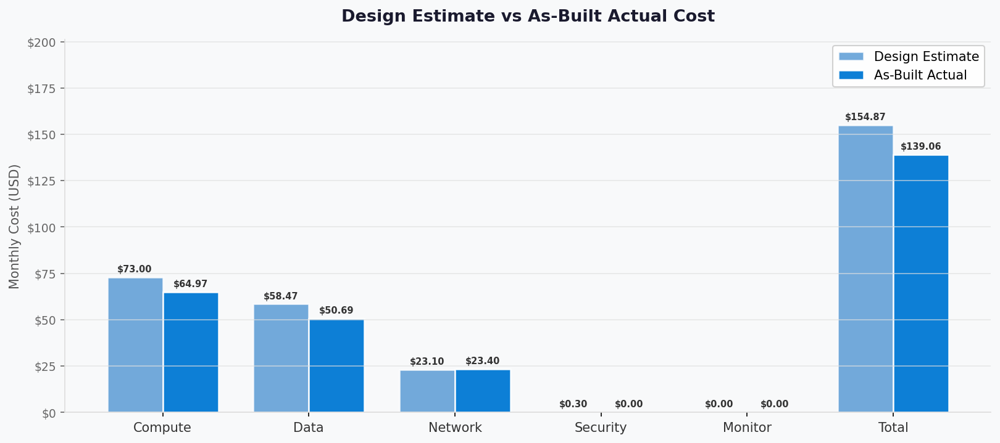
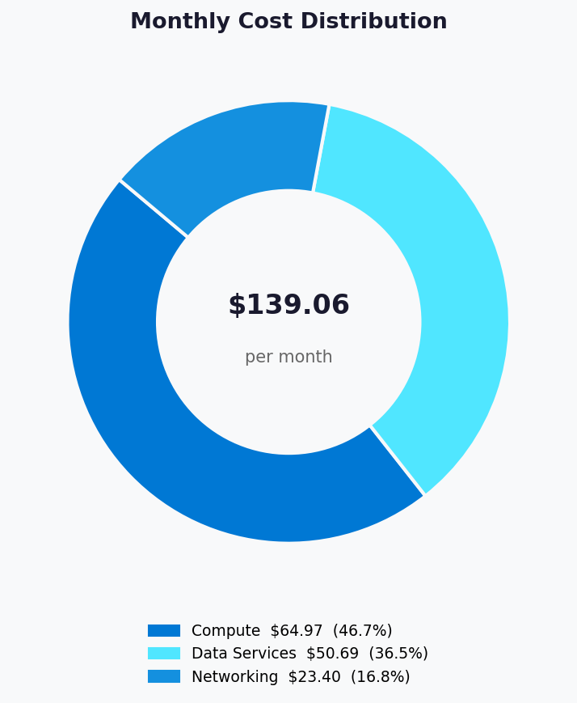
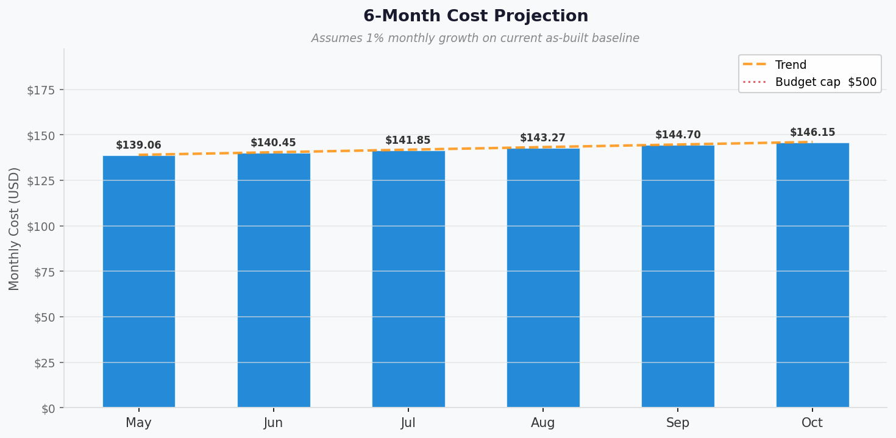

# 💰 As-Built Cost Estimate: malta-catering


<details open>
<summary><strong>📑 As-Built Cost Contents</strong></summary>

- [💵 Cost At-a-Glance](#-cost-at-a-glance)
- [✅ Decision Summary](#-decision-summary)
- [🔁 Requirements → Cost Mapping](#-requirements--cost-mapping)
- [📊 Top 5 Cost Drivers](#-top-5-cost-drivers)
- [🏛️ Architecture Overview](#%EF%B8%8F-architecture-overview)
- [🧾 What We Are Not Paying For (Yet)](#-what-we-are-not-paying-for-yet)
- [⚠️ Cost Risk Indicators](#%EF%B8%8F-cost-risk-indicators)
- [🎯 Quick Decision Matrix](#-quick-decision-matrix)
- [💰 Savings Opportunities](#-savings-opportunities)
- [🧾 Detailed Cost Breakdown](#-detailed-cost-breakdown)
- [References](#references)

</details>

> Generated by 08-As-Built agent | 2026-04-15

<div align="center">

| ⬅️ Previous                                        | 📑 Index            | Next ➡️ |
| -------------------------------------------------- | ------------------- | ------- |
| [07-compliance-matrix.md](07-compliance-matrix.md) | [README](README.md) | —       |

</div>

**Generated**: 2026-04-15
**Source**: Deployed resource inventory + `cost-estimate-subagent`
**Region**: swedencentral
**Environment**: Development
**MCP Tools Used**: `cost-estimate-subagent` via Azure Pricing MCP
**IaC Reference**: [../../infra/bicep/malta-catering/](../../infra/bicep/malta-catering/)

## 💵 Cost At-a-Glance

> **Monthly Total: $139.06** | Annual: $1,668.72
>
> ```text
> Budget: $500/month (soft) | Utilization: 27.8% ($139.06 of $500)
> ```
>
> | Status            | Indicator                                    |
> | ----------------- | -------------------------------------------- |
> | Cost Trend        | ➡️ Stable baseline with usage-based unknowns |
> | Savings Available | 💰 Not quantified in this run                |
> | Compliance        | ✅ GDPR-aligned regional placement           |

## ✅ Decision Summary

- ✅ Implemented: `P0v3` Linux App Service Plan, production Web App, staging slot, Premium ACR, Standard LRS Storage, Key Vault Standard, 3 private endpoints, 3 private DNS zones, Log Analytics, Application Insights, and a monthly budget resource.
- ⏳ Deferred: Automated Table Storage backup/export, platform authentication, availability alerting, multi-region recovery.
- 🔁 Redesign Trigger: Any requirement for warm regional failover, measured backup RPO, or materially higher production traffic will require a new pricing pass.

**Confidence**: Medium | **Expected Variance**: ±15% because several services are usage-based and were returned as zero-baseline in the pricing run without measured consumption telemetry.

### Design vs As-Built Summary

| Metric           | Design Estimate | As-Built  | Variance | Status |
| ---------------- | --------------- | --------- | -------- | ------ |
| Monthly Estimate | $154.87         | $139.06   | -$15.81  | ⚠️     |
| Annual Estimate  | $1,858.44       | $1,668.72 | -$189.72 | ⚠️     |



The as-built baseline is lower than the design estimate because the live pricing run treated Storage, Key Vault, Application Insights, Log Analytics, and Event Grid as usage-based services with no fixed baseline charge in the absence of observed consumption figures.

## 🔁 Requirements → Cost Mapping

| Requirement                  | Architecture Decision                     | Cost Impact                      | Mandatory |
| ---------------------------- | ----------------------------------------- | -------------------------------- | --------- |
| Always-on container hosting  | `P0v3` Linux App Service Plan             | $64.97/month                     | Yes       |
| Private backend connectivity | 3 private endpoints + 3 private DNS zones | $23.40/month                     | Yes       |
| Private container image pull | ACR Premium                               | $50.69/month                     | Yes       |
| EU data residency            | `swedencentral` placement                 | $0.00 direct delta               | Yes       |
| Secrets management           | Key Vault Standard                        | $0.00 baseline, operations-based | Yes       |

## 📊 Top 5 Cost Drivers

| Rank | Resource                                   | Monthly Cost | % of Total | Trend | Optimization                                       |
| ---- | ------------------------------------------ | ------------ | ---------- | ----- | -------------------------------------------------- |
| 1️⃣   | App Service Plan `P0v3`                    | $64.97       | 46.7%      | ➡️    | Reservation pricing not quantified in this run     |
| 2️⃣   | ACR Premium                                | $50.69       | 36.5%      | ➡️    | Clean up unused images to limit usage-based growth |
| 3️⃣   | Private Endpoints                          | $21.90       | 15.7%      | ➡️    | Fixed baseline at current endpoint count           |
| 4️⃣   | Private DNS Zones                          | $1.50        | 1.1%       | ➡️    | Fixed baseline at current zone count               |
| 5️⃣   | Storage / Key Vault / Monitoring baselines | $0.00        | 0.0%       | ➡️    | Reprice after 30 days of real telemetry            |

> 💡 **Quick Win**: Re-run the cost estimate after 30 days of usage telemetry to replace the current zero-baseline assumptions for Storage, Key Vault, and monitoring services.

<details>
<summary><strong>Cost Driver Details</strong></summary>

#### 1️⃣ App Service Plan `P0v3`

| Aspect            | Detail                                          |
| ----------------- | ----------------------------------------------- |
| Current SKU       | `P0v3` Linux dedicated                          |
| Monthly Cost      | $64.97                                          |
| Cost Breakdown    | `$0.089/hour x 730 hours`                       |
| Optimization      | Reserved pricing was not quantified in this run |
| Potential Savings | Not quantified                                  |

</details>

## 🏛️ Architecture Overview

### Cost Distribution

| Category         | Monthly Cost (USD) | Share |
| ---------------- | -----------------: | ----: |
| 💻 Compute       |              64.97 | 46.7% |
| 💾 Data Services |              50.69 | 36.5% |
| 🌐 Networking    |              23.40 | 16.8% |



### Month-over-Month Projection



Projection uses the priced as-built baseline and a conservative 1% month-over-month growth assumption to reflect usage-based services that were not fully priced in the live run.

### Key Design Decisions Affecting Cost

| Decision               | Cost Impact  | Business Rationale                                       | Status   |
| ---------------------- | ------------ | -------------------------------------------------------- | -------- |
| `P0v3` instead of `S1` | $64.97/month | Regional deployment viability in the active subscription | Required |
| ACR Premium            | $50.69/month | Required for private endpoint support                    | Required |
| 3 private endpoints    | $21.90/month | Private access to Storage, Key Vault, and ACR            | Required |
| 3 private DNS zones    | $1.50/month  | Name resolution for private endpoints                    | Required |

## 🧾 What We Are Not Paying For (Yet)

- Azure Front Door or WAF
- Warm secondary-region deployment
- Automated Table Storage backup/export process
- Application alert rules or action groups
- Measured data transfer, storage transaction, and log-ingestion overages

## ⚠️ Cost Risk Indicators

| Resource          | Risk Level | Issue                                              | Mitigation                                           |
| ----------------- | ---------- | -------------------------------------------------- | ---------------------------------------------------- |
| Storage Account   | 🟡 Medium  | Baseline excludes transactions and capacity growth | Re-estimate after usage telemetry is available       |
| Log Analytics     | 🟡 Medium  | Ingestion cost unresolved in this run              | Keep daily quota at 5 GB and review ingestion volume |
| ACR Premium       | 🟢 Low     | Fixed unit priced, but storage growth not included | Enforce image cleanup and retention                  |
| Private Endpoints | 🟢 Low     | Fixed hourly baseline                              | No action unless endpoint count changes              |

> **⚠️ Watch Item**: The current as-built total is a baseline-only figure. It will rise once live usage for Storage, Key Vault operations, Event Grid activity, and monitoring ingestion is measured.

## 🎯 Quick Decision Matrix

_"If you need X, expect to pay Y more"_

| Requirement                    | Additional Cost                        | SKU Change                      | Verdict        | Notes                                   |
| ------------------------------ | -------------------------------------- | ------------------------------- | -------------- | --------------------------------------- |
| Warm regional DR               | Not quantified in this run             | Additional region-wide stack    | 🔴 Investigate | Requires a fresh pricing pass           |
| Measured backup/export         | Not quantified in this run             | Additional automation resources | 🟡 Monitor     | Needed before production use            |
| Availability alerts            | Not quantified in this run             | Monitoring add-ons              | 🟡 Monitor     | Operationally recommended               |
| Slot parity and authentication | No meaningful baseline impact expected | Config only                     | 🟢 Go          | Mostly governance and runtime hardening |

## 💰 Savings Opportunities

> ### Savings: Not Quantified in This Run
>
> This estimate covers baseline consumption pricing only. Reservation and
> commitment strategies should be evaluated once production workload patterns
> and SKU selections are confirmed.
>
> **Eligible strategies to evaluate**:
>
> | Strategy                | Applicability | Prerequisites                                    |
> | ----------------------- | ------------- | ------------------------------------------------ |
> | Reserved Instances (RI) | ✅            | Stable App Service plan usage                    |
> | Savings Plan (SP)       | ✅            | Committed compute spend confirmed                |
> | Spot / Low Priority     | ❌            | Not applicable to the current App Service design |
> | Right-sizing            | ✅            | 30-day utilization data available                |
> | Dev/Test Pricing        | ✅            | Confirm subscription and licensing eligibility   |

## 🧾 Detailed Cost Breakdown

### IaC / Pricing Coverage

| Signal             | Value                                                                                                                                                    | Status |
| ------------------ | -------------------------------------------------------------------------------------------------------------------------------------------------------- | ------ |
| Templates scanned  | 10                                                                                                                                                       | ✅     |
| Resources detected | 12 cost-relevant services/components                                                                                                                     | ✅     |
| Resources priced   | 4 baseline-priced line items                                                                                                                             | ⚠️     |
| Unpriced resources | Storage usage, Key Vault operations, Log Analytics ingestion, Application Insights effective billing path, Event Grid operations, ACR stored data growth | ⚠️     |

### Line Items

| Category         | Service                                  | SKU / Meter                    | Quantity / Units       | Est. Monthly |
| ---------------- | ---------------------------------------- | ------------------------------ | ---------------------- | ------------ |
| 💻 Compute       | Azure App Service Plan (Linux dedicated) | `P0v3`                         | `730 hours`            | $64.97       |
| 💻 Compute       | Azure App Service Web App                | Included in plan               | `1 site + 1 slot`      | $0.00        |
| 💾 Data Services | Azure Container Registry                 | `Premium`                      | `1 registry unit`      | $50.69       |
| 💾 Data Services | Azure Storage Account                    | `Standard_LRS`                 | Usage-based            | $0.00        |
| 🔐 Security/Mgmt | Azure Key Vault                          | `Standard`                     | Usage-based            | $0.00        |
| 🌐 Networking    | Private Endpoints                        | Standard Private Endpoint      | `3 x 730 hours`        | $21.90       |
| 🌐 Networking    | Private DNS Zones                        | Azure DNS Private Zone         | `3 zones`              | $1.50        |
| 📊 Monitoring    | Log Analytics Workspace                  | `PerGB2018`                    | Low usage assumed      | $0.00        |
| 📊 Monitoring    | Application Insights                     | Workspace-linked web component | Low usage assumed      | $0.00        |
| 📨 Messaging     | Event Grid system topic                  | Standard operations            | No baseline identified | $0.00        |

### Notes

- Pricing copied verbatim from the `cost-estimate-subagent` result and not hand-adjusted.
- The returned estimate status was `PARTIAL` and confidence was `Medium`.
- Design-vs-as-built variance is negative because the design artifact carried explicit baseline assumptions for Storage and monitoring that the as-built pricing run left unresolved at zero baseline.
- Query timestamp reported by the pricing subagent: `2026-04-15T00:00:00Z`.

---

## References

| Topic                    | Link                                                                                                                   |
| ------------------------ | ---------------------------------------------------------------------------------------------------------------------- |
| Azure Pricing Calculator | [Calculator](https://azure.microsoft.com/pricing/calculator/)                                                          |
| Cost Management          | [Overview](https://learn.microsoft.com/azure/cost-management-billing/costs/overview-cost-management)                   |
| Reserved Instances       | [Reservations](https://learn.microsoft.com/azure/cost-management-billing/reservations/save-compute-costs-reservations) |
| WAF Cost Optimization    | [Checklist](https://learn.microsoft.com/azure/well-architected/cost-optimization/checklist)                            |

---

<div align="center">

| ⬅️ [07-compliance-matrix.md](07-compliance-matrix.md) | 🏠 [Project Index](README.md) | ➡️ — |
| ----------------------------------------------------- | ----------------------------- | ---- |

</div>
