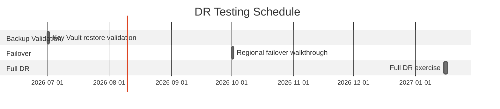

# 🛡️ Backup and Disaster Recovery Plan: malta-catering


<details open>
<summary><strong>📑 DR Plan Contents</strong></summary>

- [📋 Executive Summary](#-executive-summary)
- [🎯 1. Recovery Objectives](#-1-recovery-objectives)
- [💾 2. Backup Strategy](#-2-backup-strategy)
- [🌍 3. Disaster Recovery Procedures](#-3-disaster-recovery-procedures)
- [🧪 4. Testing Schedule](#-4-testing-schedule)
- [📢 5. Communication Plan](#-5-communication-plan)
- [👥 6. Roles and Responsibilities](#-6-roles-and-responsibilities)
- [🔗 7. Dependencies](#-7-dependencies)
- [📖 8. Recovery Runbooks](#-8-recovery-runbooks)
- [📎 9. Appendix](#-9-appendix)
- [References](#references)

</details>

> Generated by 08-As-Built agent | 2026-04-15

| ⬅️ Previous                                          | 📑 Index            | Next ➡️                                            |
| ---------------------------------------------------- | ------------------- | -------------------------------------------------- |
| [07-resource-inventory.md](07-resource-inventory.md) | [README](README.md) | [07-compliance-matrix.md](07-compliance-matrix.md) |

**Generated**: 2026-04-15
**Version**: 1.0
**Environment**: Development
**Primary Region**: swedencentral
**Secondary Region**: germanywestcentral (planned failover target only)

---

## 📋 Executive Summary

> [!IMPORTANT]
> This document defines the backup strategy and disaster recovery procedures for malta-catering.

| Metric           | Current                    | Target   |
| ---------------- | -------------------------- | -------- |
| **RPO**          | Best-effort for order data | 12 hours |
| **RTO**          | 24 hours via IaC redeploy  | 24 hours |
| **Availability** | Single-region deployment   | 99.0%    |

---

## 🎯 1. Recovery Objectives

### 1.1 Recovery Time Objective (RTO)

| Tier         | RTO Target | Services                                           |
| ------------ | ---------- | -------------------------------------------------- |
| 🔴 Critical  | 24 hours   | App Service plan, production site, storage account |
| 🟠 Important | 24 hours   | Key Vault, ACR, private endpoints, DNS zones       |
| 🟢 Standard  | 48 hours   | Monitoring workspace, Application Insights, budget |

### 1.2 Recovery Point Objective (RPO)

| Data Type                   | RPO Target            | Backup Strategy                       |
| --------------------------- | --------------------- | ------------------------------------- |
| App configuration           | Rebuild from IaC      | Bicep + parameter file + app settings |
| Key Vault secrets           | 7 days recoverability | Soft delete and purge protection      |
| Order data in Table Storage | Best-effort           | No automated export deployed          |

```mermaid
%%{init: {'theme':'neutral'}}%%
gantt
    title RPO / RTO Targets by Tier
    dateFormat HH:mm
    axisFormat %H:%M
    section Critical
        RPO :crit, rpo1, 00:00, 12h
        RTO :crit, rto1, 00:00, 24h
    section Important
        RPO :rpo2, 00:00, 7h
        RTO :rto2, 00:00, 24h
    section Standard
        RPO :rpo3, 00:00, 24h
        RTO :rto3, 00:00, 48h
```



---

## 💾 2. Backup Strategy

<details>
<summary><strong>💾 Azure Storage Account</strong></summary>

| Setting        | Configuration                                     |
| -------------- | ------------------------------------------------- |
| Backup Type    | None deployed                                     |
| Retention      | Application-managed only                          |
| Geo-Redundancy | Not enabled (`Standard_LRS`)                      |
| Gap            | No automated Table Storage export or restore path |

**Point-in-Time Restore Command:**

```bash
az storage account show -g rg-malta-catering-dev -n stmaltadevb6lg3l
```

</details>

<details>
<summary><strong>🔐 Azure Key Vault</strong></summary>

| Setting          | Configuration |
| ---------------- | ------------- |
| Soft Delete      | Enabled       |
| Purge Protection | Enabled       |

</details>

<details>
<summary><strong>📦 Azure Container Registry</strong></summary>

| Setting          | Configuration                  |
| ---------------- | ------------------------------ |
| Tier             | Premium                        |
| Retention Policy | 15 days for untagged manifests |
| Geo-Redundancy   | Not configured                 |

</details>

---

## 🌍 3. Disaster Recovery Procedures

<details>
<summary><strong>🌍 Region Failover</strong></summary>

### 3.1 Failover Procedure

1. Confirm a regional service event or unrecoverable platform issue in `swedencentral`.
2. Select `germanywestcentral` as the recovery region for an EU-hosted redeploy.
3. Re-run the Bicep deployment with region overrides and compliant resource-group tags.
4. Re-push or re-import the required container image into a recovery ACR if registry access is unavailable.
5. Reconfigure application secrets and validate container startup before exposing the site.
6. Restore order data only if an out-of-band export exists; otherwise communicate best-effort data loss.

</details>

<details>
<summary><strong>↩️ Failback Procedure</strong></summary>

### 3.2 Failback Procedure

1. Validate that `swedencentral` is stable again.
2. Compare recovery-region configuration and app settings with the source-controlled Bicep state.
3. Deploy the canonical workload back into the primary region.
4. Repoint DNS or user access paths to the primary region endpoint.
5. Decommission temporary recovery resources after verification.

</details>

---

## 🧪 4. Testing Schedule

| Test Type                  | Frequency   | Last Test   | Next Test  |
| -------------------------- | ----------- | ----------- | ---------- |
| App configuration redeploy | Quarterly   | Not yet run | 2026-07-01 |
| Secret recovery validation | Quarterly   | Not yet run | 2026-07-01 |
| Full DR walkthrough        | Semi-annual | Not yet run | 2026-10-01 |



---

## 📢 5. Communication Plan

| Audience          | Channel           | Template                                    |
| ----------------- | ----------------- | ------------------------------------------- |
| Demo stakeholders | Email / Teams     | Incident update and service restoration ETA |
| Platform owner    | Direct escalation | Technical failure summary                   |
| Management        | Escalation mail   | Business impact and recovery decision       |

---

## 👥 6. Roles and Responsibilities

| Role                | Team           | Responsibility                                 |
| ------------------- | -------------- | ---------------------------------------------- |
| Platform Owner      | Demo Platform  | Execute redeploy and infrastructure recovery   |
| Application Owner   | Malta Catering | Validate application behavior after recovery   |
| Stakeholder Contact | Demo sponsor   | Approve fallback decisions if data loss occurs |

---

## 🔗 7. Dependencies

| Dependency                                       | Impact                                  | Mitigation                                                       |
| ------------------------------------------------ | --------------------------------------- | ---------------------------------------------------------------- |
| Container image in ACR                           | App cannot start without image pull     | Keep canonical image tagged and document import procedure        |
| Key Vault secret `appinsights-connection-string` | Missing secret breaks telemetry wiring  | Recover from Key Vault soft delete or recreate from App Insights |
| Table Storage order data                         | No automated restore path today         | Document best-effort recovery and prioritize export automation   |
| Private DNS and private endpoints                | Backend connectivity failure if missing | Redeploy network phase before compute validation                 |

---

## 📖 8. Recovery Runbooks

| Scenario                             | Runbook                                              | Owner          |
| ------------------------------------ | ---------------------------------------------------- | -------------- |
| Production endpoint returns `503`    | Restart app, verify container image and app settings | Platform Owner |
| Secret deletion or Key Vault lockout | Recover secret or rehydrate from source metadata     | Platform Owner |
| Regional outage                      | Rebuild to secondary EU region from Bicep            | Platform Owner |

<details>
<summary><strong>📖 Runbook: Production 503 Recovery</strong></summary>

**Trigger**: Production or staging endpoint returns `HTTP 503`
**Estimated Duration**: 30-60 minutes

1. Confirm App Service plan and site are in `Running` state.
2. Verify `linuxFxVersion`, ACR pull settings, and Key Vault reference app settings.
3. Restart the site and slot, then re-run the health probes.
4. If the issue persists, inspect application/container logs and validate image availability.

**Validation**:

```bash
curl -I -L --max-time 20 https://app-malta-catering-dev.azurewebsites.net
curl -I -L --max-time 20 https://app-malta-catering-dev-staging.azurewebsites.net
```

</details>

---

## 📎 9. Appendix

<details>
<summary>📋 Detailed Recovery Procedures</summary>

- Control-plane rebuild is viable because the workload is defined in Bicep and parameterized.
- Data-plane recovery is weakest for Table Storage because no export job or secondary replica exists.
- The staging slot identity is deployed but has no role assignments; repair this before relying on the slot during DR validation.

</details>

---

## References

> [!NOTE]
> 📚 The following Microsoft Learn resources provide DR guidance.

| Topic                 | Link                                                                                            |
| --------------------- | ----------------------------------------------------------------------------------------------- |
| Azure Backup Overview | [Backup Overview](https://learn.microsoft.com/azure/backup/backup-overview)                     |
| Backup Best Practices | [Best Practices](https://learn.microsoft.com/azure/backup/backup-best-practices)                |
| RTO/RPO Guidance      | [Reliability Metrics](https://learn.microsoft.com/azure/well-architected/reliability/metrics)   |
| Site Recovery         | [ASR Overview](https://learn.microsoft.com/azure/site-recovery/site-recovery-overview)          |
| Business Continuity   | [DR Planning](https://learn.microsoft.com/azure/well-architected/reliability/disaster-recovery) |

---

_Backup and DR plan generated from infrastructure artifacts._

---

<div align="center">

| ⬅️ [07-resource-inventory.md](07-resource-inventory.md) | 🏠 [Project Index](README.md) | ➡️ [07-compliance-matrix.md](07-compliance-matrix.md) |
| ------------------------------------------------------- | ----------------------------- | ----------------------------------------------------- |

</div>
