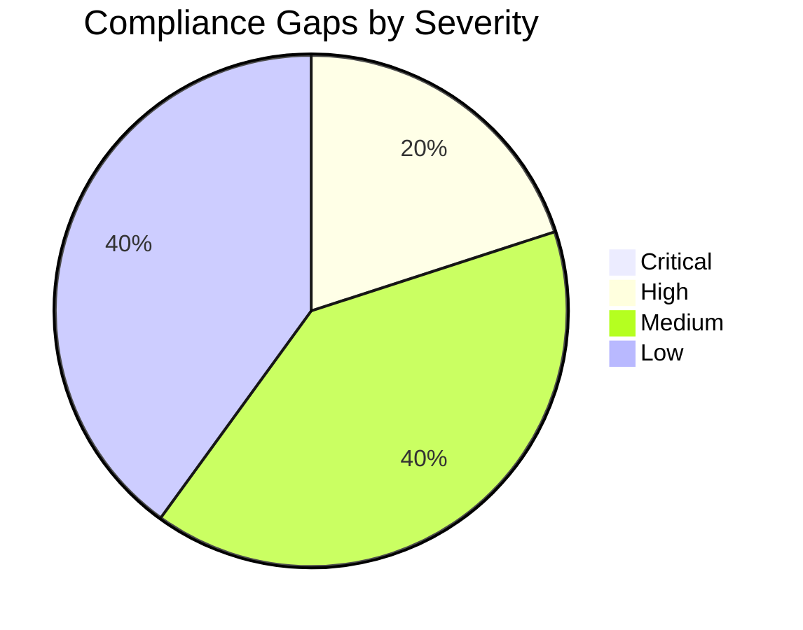

# ⚖️ Compliance Matrix: malta-catering

<strong>📑 Compliance Contents</strong>

- [📋 Executive Summary](#-executive-summary)
- [🗺️ 1. Control Mapping](#%EF%B8%8F-1-control-mapping)
- [🔍 2. Gap Analysis](#-2-gap-analysis)
- [📁 3. Evidence Collection](#-3-evidence-collection)
- [📝 4. Audit Trail](#-4-audit-trail)
- [🔧 5. Remediation Tracker](#-5-remediation-tracker)
- [📎 6. Appendix](#-6-appendix)
- [References](#references)

> Generated by 08-As-Built agent | 2026-04-15

| ⬅️ Previous                                  | 📑 Index            | Next ➡️                                          |
| -------------------------------------------- | ------------------- | ------------------------------------------------ |
| [07-backup-dr-plan.md](07-backup-dr-plan.md) | [README](README.md) | [07-ab-cost-estimate.md](07-ab-cost-estimate.md) |

**Generated**: 2026-04-15
**Version**: 1.0
**Environment**: Development
**Primary Compliance Framework**: GDPR

---

## 📋 Executive Summary

> [!IMPORTANT]
> This compliance matrix maps the malta-catering security controls to GDPR-oriented workload controls and the deployed Azure security baseline.

| Compliance Area    | Coverage | Status |
| ------------------ | -------- | ------ |
| Network Security   | 90%      | ✅     |
| Data Protection    | 75%      | ⚠️     |
| Access Control     | 67%      | ⚠️     |
| Monitoring & Audit | 60%      | ⚠️     |
| Incident Response  | 50%      | ⚠️     |
| Overall            | 68%      | ⚠️     |

---

## 🗺️ 1. Control Mapping

### Requirement 1: GDPR Data Residency and Network Security

| Control                   | Requirement                            | Implementation                                                               | Status |
| ------------------------- | -------------------------------------- | ---------------------------------------------------------------------------- | ------ |
| EU region residency       | Personal data remains in an EU region  | All primary resources deployed in `swedencentral`                            | ✅     |
| Backend network isolation | Data services not publicly reachable   | Storage, Key Vault, and ACR use private endpoints and disabled public access | ✅     |
| Encryption in transit     | TLS 1.2+ for customer-facing endpoints | Production and staging sites enforce TLS 1.2 and HTTPS-only                  | ✅     |

<strong>📎 Evidence</strong>

**Evidence Location**: `agent-output/malta-catering/.asbuilt/`

| Evidence Item   | Type             | Date Collected |
| --------------- | ---------------- | -------------- |
| `webapp.json`   | Azure CLI output | 2026-04-15     |
| `keyvault.json` | Azure CLI output | 2026-04-15     |
| `storage.json`  | Azure CLI output | 2026-04-15     |

### Requirement 2: Access Control and Secret Management

| Control                       | Requirement                                                    | Implementation                                                                                | Status |
| ----------------------------- | -------------------------------------------------------------- | --------------------------------------------------------------------------------------------- | ------ |
| Production workload identity  | Least-privilege access to dependencies                         | Production site has `AcrPull`, `Key Vault Secrets User`, and `Storage Table Data Contributor` | ✅     |
| Staging slot access parity    | Pre-production path should mirror production dependency access | Slot identity exists but has no direct RBAC assignments                                       | ⚠️     |
| Customer/staff authentication | Identity boundary should be enforced at the web tier           | App Service Authentication is disabled in the deployed state                                  | ⚠️     |

<strong>📎 Evidence</strong>

**Evidence Location**: `agent-output/malta-catering/.asbuilt/`

| Evidence Item       | Type              | Date Collected |
| ------------------- | ----------------- | -------------- |
| `webapp-rbac.json`  | Azure RBAC export | 2026-04-15     |
| `staging-rbac.json` | Azure RBAC export | 2026-04-15     |
| `webapp-auth.json`  | Azure CLI output  | 2026-04-15     |

### Requirement 3: Logging, Audit, and Recovery Evidence

| Control               | Requirement                                        | Implementation                                               | Status |
| --------------------- | -------------------------------------------------- | ------------------------------------------------------------ | ------ |
| Centralized logging   | Workload telemetry retained centrally              | Log Analytics workspace deployed with 30-day retention       | ✅     |
| Application telemetry | Request and failure telemetry for the web workload | Workspace-linked Application Insights deployed               | ✅     |
| Backup evidence       | Recoverability evidence for order data             | No automated Table Storage export or backup process deployed | ⚠️     |

<strong>📎 Evidence</strong>

**Evidence Location**: `agent-output/malta-catering/.asbuilt/`

| Evidence Item       | Type                        | Date Collected |
| ------------------- | --------------------------- | -------------- |
| `loganalytics.json` | Azure CLI output            | 2026-04-15     |
| `appinsights.json`  | Azure CLI output            | 2026-04-15     |
| `curl-prod.txt`     | Runtime verification output | 2026-04-15     |

---

## 🔍 2. Gap Analysis

| Gap                                            | Severity  | Risk Level                                                                | Remediation                                                       | Timeline              |
| ---------------------------------------------- | --------- | ------------------------------------------------------------------------- | ----------------------------------------------------------------- | --------------------- |
| Staging slot has no direct RBAC assignments    | 🟠 High   | Slot cannot reliably access ACR, Key Vault, or Storage during validation  | Grant the same three roles assigned to production                 | Before next slot use  |
| App Service Authentication is disabled         | 🟡 Medium | Customer and staff identity boundary is not enforced at the platform edge | Enable Easy Auth and configure the required identity provider(s)  | Before demo hardening |
| No automated Table Storage export/backup       | 🟡 Medium | Order data cannot be restored after logical deletion or corruption        | Add scheduled export to Blob Storage or equivalent backup process | Before production use |
| No application alert rules or action groups    | 🟢 Low    | Failures rely on manual observation rather than alerting                  | Add availability and failure alerts                               | Next iteration        |
| Monitoring endpoints remain publicly reachable | 🟢 Low    | App Insights and Log Analytics are not restricted by private access       | Reassess if stricter monitoring isolation becomes required        | Optional              |

❌ Production and staging endpoint probes returned HTTP `503` during the Step 7 evidence collection window, so operational recovery remains open until availability is restored.

---

## 📁 3. Evidence Collection

<strong>📁 Evidence Items</strong>

| Control              | Evidence Type  | Location                                              | Last Collected |
| -------------------- | -------------- | ----------------------------------------------------- | -------------- |
| Network isolation    | Azure CLI JSON | `.asbuilt/private-endpoints.json`                     | 2026-04-15     |
| Workload identity    | Azure CLI JSON | `.asbuilt/webapp-rbac.json`                           | 2026-04-15     |
| Slot identity gap    | Azure CLI JSON | `.asbuilt/staging-rbac.json`                          | 2026-04-15     |
| Authentication state | Azure CLI JSON | `.asbuilt/webapp-auth.json`                           | 2026-04-15     |
| Runtime availability | HTTP probe     | `.asbuilt/curl-prod.txt`, `.asbuilt/curl-staging.txt` | 2026-04-15     |

---

## 📝 4. Audit Trail

| Date       | Auditor           | Finding                             | Status | Commit |
| ---------- | ----------------- | ----------------------------------- | ------ | ------ |
| 2026-04-15 | 08-As-Built agent | Private backend isolation verified  | Closed | N/A    |
| 2026-04-15 | 08-As-Built agent | Staging slot RBAC missing           | Open   | N/A    |
| 2026-04-15 | 08-As-Built agent | App Service Authentication disabled | Open   | N/A    |

---

## 🔧 5. Remediation Tracker

| Finding                                                                                      | Owner             | Due Date   | Status         |
| -------------------------------------------------------------------------------------------- | ----------------- | ---------- | -------------- |
| Grant staging slot `AcrPull`, `Key Vault Secrets User`, and `Storage Table Data Contributor` | Platform owner    | 2026-04-22 | 🔄 In Progress |
| Enable App Service Authentication                                                            | Application owner | 2026-04-22 | ⬜ Todo        |
| Implement storage export backup path                                                         | Platform owner    | 2026-05-15 | ⬜ Todo        |
| Add application alert rules                                                                  | Platform owner    | 2026-05-15 | ⬜ Todo        |

---

## 📎 6. Appendix

### A. Compliance Framework Reference

This workload maps primarily to GDPR-adjacent controls relevant to data residency, access control, traceability, and recoverability. PCI-DSS, HIPAA, and SOC 2 were not in scope for the original requirements set.

### B. Azure Security Baseline Mapping

- Storage account hardening: HTTPS-only, TLS 1.2, public access disabled, shared key disabled.
- Key Vault hardening: RBAC enabled, purge protection enabled, soft delete enabled, public network disabled.
- Registry hardening: Premium tier, admin user disabled, public network disabled, retention enabled.
- Web tier: HTTPS-only, TLS 1.2, managed identity enabled.

---

## References

> [!NOTE]
> 📚 The following Microsoft Learn resources provide compliance guidance.

| Topic                              | Link                                                                                                                        |
| ---------------------------------- | --------------------------------------------------------------------------------------------------------------------------- |
| Microsoft Cloud Security Benchmark | [MCSB Overview](https://learn.microsoft.com/security/benchmark/azure/overview)                                              |
| Azure Compliance Offerings         | [Compliance](https://learn.microsoft.com/azure/compliance/)                                                                 |
| Azure Policy                       | [Policy Overview](https://learn.microsoft.com/azure/governance/policy/overview)                                             |
| Regulatory Compliance              | [Built-in Policies](https://learn.microsoft.com/azure/governance/policy/samples/built-in-initiatives#regulatory-compliance) |

---

_Compliance matrix generated from infrastructure artifacts._

---

| ⬅️ [07-backup-dr-plan.md](07-backup-dr-plan.md) | 🏠 [Project Index](README.md) | ➡️ [07-ab-cost-estimate.md](07-ab-cost-estimate.md) |
| ----------------------------------------------- | ----------------------------- | --------------------------------------------------- |

