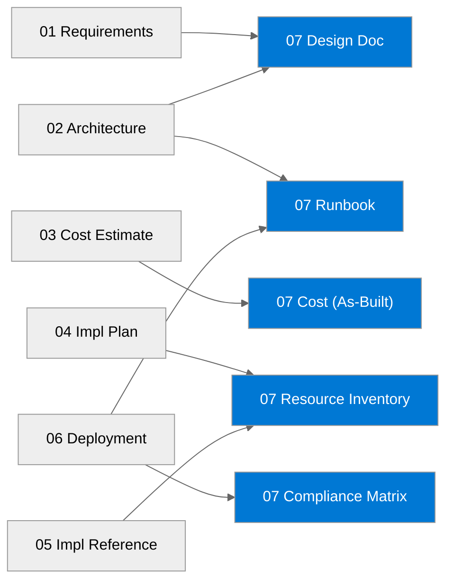

# 📚 malta-catering - Workload Documentation

<strong>📑 Documentation Contents</strong>

- [📦 1. Document Package Contents](#-1-document-package-contents)
- [📚 2. Source Artifacts](#-2-source-artifacts)
- [📋 3. Project Summary](#-3-project-summary)
- [🔗 4. Related Resources](#-4-related-resources)
- [⚡ 5. Quick Links](#-5-quick-links)

> Generated by 08-As-Built agent | 2026-04-15

| ⬅️ Previous                                          | 📑 Index            | Next ➡️                                        |
| ---------------------------------------------------- | ------------------- | ---------------------------------------------- |
| [06-deployment-summary.md](06-deployment-summary.md) | [README](README.md) | [07-design-document.md](07-design-document.md) |

**Generated**: 2026-04-15
**Version**: 1.0
**Status**: Complete

---

## 📦 1. Document Package Contents

| Document                                           | Description                        | Status                                                        |
| -------------------------------------------------- | ---------------------------------- | ------------------------------------------------------------- |
| [Design Document](./07-design-document.md)         | Comprehensive architecture design  |  |
| [Operations Runbook](./07-operations-runbook.md)   | Day-2 operational procedures       |  |
| [Resource Inventory](./07-resource-inventory.md)   | Complete deployed resource listing |  |
| [Backup & DR Plan](./07-backup-dr-plan.md)         | Recovery procedures and failover   |  |
| [Compliance Matrix](./07-compliance-matrix.md)     | Security controls mapping          |  |
| [As-Built Cost Estimate](./07-ab-cost-estimate.md) | Deployed pricing baseline          |  |
| [As-Built Diagram](./07-ab-diagram.drawio)         | Editable Draw.io architecture view |  |

---

## 📚 2. Source Artifacts

These documents were generated from the following agentic workflow outputs:

| Artifact            | Source                           | Generated  |
| ------------------- | -------------------------------- | ---------- |
| Requirements        | `01-requirements.md`             | 2026-04-14 |
| WAF Assessment      | `02-architecture-assessment.md`  | 2026-04-14 |
| Cost Estimate       | `03-des-cost-estimate.md`        | 2026-04-14 |
| Implementation Plan | `04-implementation-plan.md`      | 2026-04-14 |
| Bicep Code          | `05-implementation-reference.md` | 2026-04-14 |
| Deployment Summary  | `06-deployment-summary.md`       | 2026-04-15 |

---

## 📋 3. Project Summary

| Attribute          | Value                                       |
| ------------------ | ------------------------------------------- |
| **Project Name**   | `malta-catering`                            |
| **Environment**    | `dev`                                       |
| **Primary Region** | `swedencentral`                             |
| **Compliance**     | `GDPR`                                      |
| **Monthly Cost**   | `$139.06/month` baseline, medium confidence |

---

## 🔗 4. Related Resources

- **Infrastructure Code**: [../../infra/bicep/malta-catering/](../../infra/bicep/malta-catering/)
- **Agent Outputs**: [./](./)
- **ADRs**: `03-des-adr-0001-app-service-s1-compute.md`, `03-des-adr-0002-table-storage-persistence.md`, `03-des-adr-0003-public-network-posture.md`

---

## ⚡ 5. Quick Links

- 📂 **Code**: [Deployment Script](../../infra/bicep/malta-catering/deploy.ps1) | [Main Bicep Template](../../infra/bicep/malta-catering/main.bicep)
- 📄 **Docs**: [Design Document](./07-design-document.md) | [Runbook](./07-operations-runbook.md) | [Compliance](./07-compliance-matrix.md)
- 🔗 **External**: [Azure Well-Architected Framework](https://learn.microsoft.com/azure/well-architected/) | [AVM Index](https://aka.ms/avm/index)

---

_Documentation index generated by Workload Documentation Generator._

---

| ⬅️ [06-deployment-summary.md](06-deployment-summary.md) | 🏠 [Project Index](README.md) | ➡️ [07-design-document.md](07-design-document.md) |
| ------------------------------------------------------- | ----------------------------- | ------------------------------------------------- |

