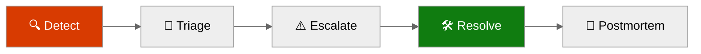
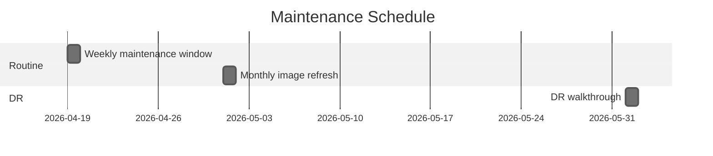
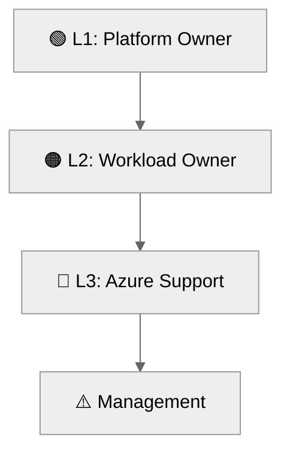

# 📖 Operations Runbook: malta-catering


<details open>
<summary><strong>📑 Runbook Contents</strong></summary>

- [⚡ Quick Reference](#-quick-reference)
- [📋 1. Daily Operations](#-1-daily-operations)
- [🚨 2. Incident Response](#-2-incident-response)
- [🔧 3. Common Procedures](#-3-common-procedures)
- [🕐 4. Maintenance Windows](#-4-maintenance-windows)
- [📞 5. Contacts & Escalation](#-5-contacts--escalation)
- [📝 6. Change Log](#-6-change-log)
- [References](#references)

</details>

> Generated by 08-As-Built agent | 2026-04-15

| ⬅️ Previous                                    | 📑 Index            | Next ➡️                                              |
| ---------------------------------------------- | ------------------- | ---------------------------------------------------- |
| [07-design-document.md](07-design-document.md) | [README](README.md) | [07-resource-inventory.md](07-resource-inventory.md) |

**Version**: 1.0
**Date**: 2026-04-15
**Environment**: Development
**Region**: swedencentral

---

## ⚡ Quick Reference

| Item                | Value                                             |
| ------------------- | ------------------------------------------------- |
| **Primary Region**  | `swedencentral`                                   |
| **Resource Group**  | `rg-malta-catering-dev`                           |
| **Support Contact** | `platform@example.com`                            |
| **Escalation Path** | Platform contact → workload owner → Azure support |

### Critical Resources

| Resource            | Name                     | Resource Group          | Severity |
| ------------------- | ------------------------ | ----------------------- | -------- |
| Web front end       | `app-malta-catering-dev` | `rg-malta-catering-dev` | 🔴 P1    |
| Storage persistence | `stmaltadevb6lg3l`       | `rg-malta-catering-dev` | 🔴 P1    |
| Secret store        | `kv-malta-dev-b6lg3l`    | `rg-malta-catering-dev` | 🟠 P2    |
| Container registry  | `acrmaltadevb6lg3l`      | `rg-malta-catering-dev` | 🟠 P2    |

> [!WARNING]
> Post-deployment validation on 2026-04-15 returned `HTTP 503` from both the production and staging endpoints. Treat this as the active operational issue until resolved.

---

## 📋 1. Daily Operations

### 1.1 Health Checks

**Morning Health Check:**

1. ✅ Confirm App Service plan state is `Running` and the production site state is `Running`.
2. ✅ Verify `curl -I` to production and staging no longer returns `503`.
3. ✅ Review Key Vault, Storage, and ACR private endpoint provisioning state.

**KQL Query - System Health Overview:**

<details>
<summary><strong>📊 Health Check KQL</strong></summary>

```kusto
AppRequests
| where TimeGenerated > ago(24h)
| summarize Requests=count(), Failures=countif(Success == false), P95=percentile(DurationMs, 95) by bin(TimeGenerated, 1h)
| order by TimeGenerated desc
```

</details>

### 1.2 Log Review

**Priority Logs to Review:**

| Log Source                | Query Focus                             | Action Threshold                  |
| ------------------------- | --------------------------------------- | --------------------------------- |
| Application Insights      | Request failures and startup exceptions | Any sustained `5xx` rate above 5% |
| App Service platform logs | Container pull or startup failures      | Any failed container start        |
| Budget notifications      | Forecast threshold crossings            | Any forecast ≥ 80%                |

---

## 🚨 2. Incident Response

### 2.1 Severity Definitions

| Severity | Definition                                            | Response Time  |
| -------- | ----------------------------------------------------- | -------------- |
| 🔴 P1    | Customer-facing site unavailable or returning `503`   | 30 minutes     |
| 🟠 P2    | Core dependency degraded but site partially available | 4 hours        |
| 🟢 P3    | Non-blocking drift or documentation/config issue      | 1 business day |

### Incident Response Flow



### 2.2 Runbooks by Alert

| Alert                       | Runbook                                               | Owner          |
| --------------------------- | ----------------------------------------------------- | -------------- |
| Production or slot `503`    | Section 3.1 restart + container verification          | Platform owner |
| Image pull failure          | Section 3.2 registry and RBAC check                   | Platform owner |
| Key Vault reference failure | Verify secret and `Key Vault Secrets User` assignment | Platform owner |
| Budget threshold triggered  | Review spend and suppress nonessential usage          | Platform owner |

---

## 🔧 3. Common Procedures

### 3.1 Restart Services

<details>
<summary>🔧 Restart App Service</summary>

```bash
az webapp restart -g rg-malta-catering-dev -n app-malta-catering-dev
az webapp restart -g rg-malta-catering-dev -n app-malta-catering-dev --slot staging
```

</details>

### 3.2 Scale Resources

<details>
<summary>📈 Scale Up/Out Commands</summary>

```bash
az appservice plan update -g rg-malta-catering-dev -n asp-malta-catering-dev --sku P1v3
az appservice plan update -g rg-malta-catering-dev -n asp-malta-catering-dev --number-of-workers 2
```

</details>

<details>
<summary>🔍 Container Configuration Verification</summary>

```bash
az webapp config container show -g rg-malta-catering-dev -n app-malta-catering-dev -o json
az webapp config appsettings list -g rg-malta-catering-dev -n app-malta-catering-dev -o table
```

</details>

---

## 🕐 4. Maintenance Windows

| Task                             | Schedule           | Duration |
| -------------------------------- | ------------------ | -------- |
| Workload maintenance window      | Sunday 02:00-06:00 | 4 hours  |
| Container refresh and validation | Monthly            | 1 hour   |
| DR procedure walkthrough         | Quarterly          | 2 hours  |



> [!TIP]
> 💡 Complete slot validation before any production swap. Current staging RBAC is incomplete and should be remediated before using the slot for cutover.

---

## 📞 5. Contacts & Escalation

| Role             | Contact                   | Phone | On-Call Rotation |
| ---------------- | ------------------------- | ----- | ---------------- |
| Platform Owner   | `platform@example.com`    | N/A   | Business hours   |
| Workload Owner   | Malta Catering demo owner | N/A   | Ad hoc           |
| Azure Escalation | Azure Support             | N/A   | N/A              |

### Escalation Path



---

## 📝 6. Change Log

| Date       | Change                                                                       | Author            |
| ---------- | ---------------------------------------------------------------------------- | ----------------- |
| 2026-04-15 | Generated Step 7 as-built runbook and recorded post-deployment `503` finding | 08-As-Built agent |

---

## References

> [!NOTE]
> 📚 The following Microsoft Learn resources provide operational guidance.

| Topic                 | Link                                                                                             |
| --------------------- | ------------------------------------------------------------------------------------------------ |
| Azure Monitor Alerts  | [Alerting Best Practices](https://learn.microsoft.com/azure/azure-monitor/best-practices-alerts) |
| Log Analytics Queries | [KQL Reference](https://learn.microsoft.com/azure/azure-monitor/logs/get-started-queries)        |
| Incident Management   | [Azure Status](https://status.azure.com/)                                                        |
| Service Health        | [Azure Service Health](https://learn.microsoft.com/azure/service-health/overview)                |

---

_Operations runbook generated from infrastructure artifacts._

---

<div align="center">

| ⬅️ [07-design-document.md](07-design-document.md) | 🏠 [Project Index](README.md) | ➡️ [07-resource-inventory.md](07-resource-inventory.md) |
| ------------------------------------------------- | ----------------------------- | ------------------------------------------------------- |

</div>
