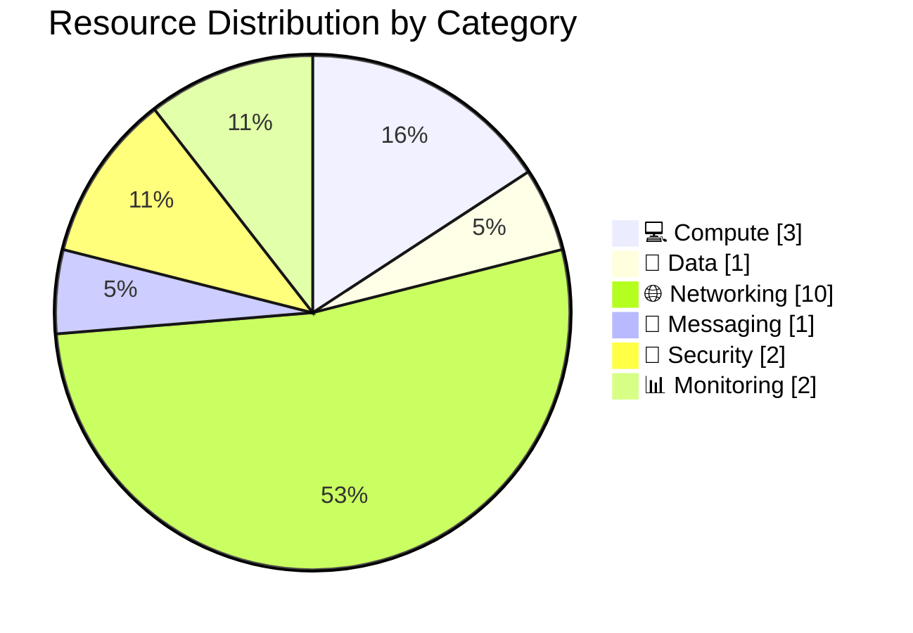

# 📦 Resource Inventory: malta-catering

<strong>📑 Inventory Contents</strong>

- [📊 Summary](#-summary)
- [📦 Resource Listing](#-resource-listing)
- [References](#references)

> Generated by 08-As-Built agent | 2026-04-15

| ⬅️ Previous                                          | 📑 Index            | Next ➡️                                      |
| ---------------------------------------------------- | ------------------- | -------------------------------------------- |
| [07-operations-runbook.md](07-operations-runbook.md) | [README](README.md) | [07-backup-dr-plan.md](07-backup-dr-plan.md) |

**Generated**: 2026-04-15
**Source**: Deployed Azure resources and implemented Bicep templates
**Environment**: Development
**Region**: swedencentral

---

## 📊 Summary

| Category            | Count |
| ------------------- | ----- |
| **Total Resources** | 20    |
| 💻 Compute          | 3     |
| 💾 Data Services    | 1     |
| 🌐 Networking       | 10    |
| 📨 Messaging        | 1     |
| 🔐 Security         | 2     |
| 📊 Monitoring       | 2     |
| 💰 Management       | 1     |

The total includes the resource-group budget and the three private DNS zones that are not surfaced by the generic `az resource list` result set but are present in the live resource group and included in the as-built evidence set under `.asbuilt/`.

---

## 📦 Resource Listing

### 💻 Compute Resources

| Name                             | Type                        | SKU              | Location        | Monthly Cost | Purpose                                       | Portal                                                                                                                                                                                                  |
| -------------------------------- | --------------------------- | ---------------- | --------------- | ------------ | --------------------------------------------- | ------------------------------------------------------------------------------------------------------------------------------------------------------------------------------------------------------- |
| `asp-malta-catering-dev`         | App Service Plan            | `P0v3`           | `swedencentral` | $64.97       | Linux dedicated compute plan for the workload | [View](https://portal.azure.com/#@/resource/subscriptions/00858ffc-dded-4f0f-8bbf-e17fff0d47d9/resourceGroups/rg-malta-catering-dev/providers/Microsoft.Web/serverfarms/asp-malta-catering-dev)         |
| `app-malta-catering-dev`         | App Service Web App         | Included in plan | `swedencentral` | $0.00        | Production container host and public endpoint | [View](https://portal.azure.com/#@/resource/subscriptions/00858ffc-dded-4f0f-8bbf-e17fff0d47d9/resourceGroups/rg-malta-catering-dev/providers/Microsoft.Web/sites/app-malta-catering-dev)               |
| `app-malta-catering-dev/staging` | App Service deployment slot | Included in plan | `swedencentral` | $0.00        | Pre-production slot for staged validation     | [View](https://portal.azure.com/#@/resource/subscriptions/00858ffc-dded-4f0f-8bbf-e17fff0d47d9/resourceGroups/rg-malta-catering-dev/providers/Microsoft.Web/sites/app-malta-catering-dev/slots/staging) |

### 💾 Data Services

| Name               | Type            | SKU            | Configuration                                                                  | Location        | Monthly Cost   |
| ------------------ | --------------- | -------------- | ------------------------------------------------------------------------------ | --------------- | -------------- |
| `stmaltadevb6lg3l` | Storage Account | `Standard_LRS` | `StorageV2`, hot tier, HTTPS-only, shared key disabled, public access disabled | `swedencentral` | $0.00 baseline |

### 🌐 Networking Resources

| Name                                      | Type                    | Configuration                                           | Location        |
| ----------------------------------------- | ----------------------- | ------------------------------------------------------- | --------------- |
| `vnet-malta-catering-dev`                 | Virtual Network         | Address space `10.0.0.0/24`                             | `swedencentral` |
| `snet-app-service`                        | Delegated subnet        | `10.0.0.0/27`, delegated to `Microsoft.Web/serverFarms` | `swedencentral` |
| `snet-private-endpoints`                  | Private endpoint subnet | `10.0.0.32/27`, private endpoint policies disabled      | `swedencentral` |
| `pep-stmaltadevb6lg3l-table-0`            | Private Endpoint        | Table Storage private link in `snet-private-endpoints`  | `swedencentral` |
| `pep-kv-malta-dev-b6lg3l-vault-0`         | Private Endpoint        | Key Vault private link in `snet-private-endpoints`      | `swedencentral` |
| `pep-acrmaltadevb6lg3l-registry-0`        | Private Endpoint        | ACR registry private link in `snet-private-endpoints`   | `swedencentral` |
| `pep-stmaltadevb6lg3l-table-0.nic...`     | Network Interface       | Managed NIC for Storage private endpoint                | `swedencentral` |
| `pep-kv-malta-dev-b6lg3l-vault-0.nic...`  | Network Interface       | Managed NIC for Key Vault private endpoint              | `swedencentral` |
| `pep-acrmaltadevb6lg3l-registry-0.nic...` | Network Interface       | Managed NIC for ACR private endpoint                    | `swedencentral` |
| `privatelink.table.core.windows.net`      | Private DNS Zone        | One VNet link, two record sets                          | `global`        |
| `privatelink.vaultcore.azure.net`         | Private DNS Zone        | One VNet link, two record sets                          | `global`        |
| `privatelink.azurecr.io`                  | Private DNS Zone        | One VNet link, three record sets                        | `global`        |

### 📨 Messaging Resources

| Name                                                    | Type                    | SKU      | Configuration                                       | Location        |
| ------------------------------------------------------- | ----------------------- | -------- | --------------------------------------------------- | --------------- |
| `stmaltadevb6lg3l-54b43000-43fb-447d-bedf-faef9631cdcf` | Event Grid system topic | Standard | Auto-created platform topic associated with storage | `swedencentral` |

### 🔐 Security Resources

| Name                  | Type               | Configuration                                                                   | Location        |
| --------------------- | ------------------ | ------------------------------------------------------------------------------- | --------------- |
| `kv-malta-dev-b6lg3l` | Key Vault          | Standard tier, RBAC enabled, purge protection on, public network disabled       | `swedencentral` |
| `acrmaltadevb6lg3l`   | Container Registry | Premium tier, admin disabled, retention policy enabled, public network disabled | `swedencentral` |

### 📊 Monitoring Resources

| Name                      | Type                    | Retention | Location        |
| ------------------------- | ----------------------- | --------- | --------------- |
| `log-malta-catering-dev`  | Log Analytics Workspace | 30 days   | `swedencentral` |
| `appi-malta-catering-dev` | Application Insights    | 90 days   | `swedencentral` |

### 💰 Management Resources

| Name                        | Type   | Configuration                                                          | Location   |
| --------------------------- | ------ | ---------------------------------------------------------------------- | ---------- |
| `budget-malta-catering-dev` | Budget | Monthly budget `$500`, notifications at forecast 80/120 and actual 100 | `rg scope` |

Budget management is tracked outside the category chart because it is a governance object rather than a workload runtime component.

---

## References

| Topic                | Link                                                                                                                   |
| -------------------- | ---------------------------------------------------------------------------------------------------------------------- |
| Azure Resource Types | [Resource Providers](https://learn.microsoft.com/azure/azure-resource-manager/management/resource-providers-and-types) |
| Naming Conventions   | [CAF Naming](https://learn.microsoft.com/azure/cloud-adoption-framework/ready/azure-best-practices/resource-naming)    |
| Pricing Calculator   | [Azure Pricing](https://azure.microsoft.com/pricing/calculator/)                                                       |

---

_Resource inventory generated from deployed Azure resources and validated against the Bicep implementation._

---

| ⬅️ [07-operations-runbook.md](07-operations-runbook.md) | 🏠 [Project Index](README.md) | ➡️ [07-backup-dr-plan.md](07-backup-dr-plan.md) |
| ------------------------------------------------------- | ----------------------------- | ----------------------------------------------- |

